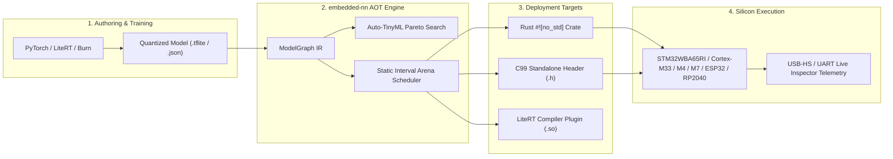

# embedded-nn

<p align="center">
  
</p>

[](https://crates.io/crates/embedded-nn)
[](https://docs.rs/embedded-nn)
[](https://github.com/leftger/embedded-nn/actions/workflows/ci.yml)
[](LICENSE-MIT)

A pure Rust, `#![no_std]` neural network inference runtime, ahead-of-time (AOT) compiler, and TinyML platform for microcontrollers and edge silicon. Designed with zero dynamic allocations, static interval-colored SRAM memory reuse, sub-byte LUT quantization, and functional safety integrity checks.

Inspired by and synergized with ARM's **CMSIS-NN**, Google's **LiteRT / TensorFlow Lite Micro**, and **MicroFlow**.

📖 **[Read the End-to-End TinyML Guide (Data Collection -> Training -> Deployment)](docs/END_TO_END_TINYML_GUIDE.md)**  
📖 **[Read the PyTorch -> LiteRT -> embedded-nn Export Workflow](docs/LITERT_PYTORCH_WORKFLOW.md)**  
📖 **[Read the Live Hardware-in-the-Loop Protocol Specification](docs/LIVE_PROTOCOL.md)**  

---

## Workspace Crates

| Crate | Description |
| :--- | :--- |
| [`crates/embedded-nn`](crates/embedded-nn) | Core `#![no_std]` runtime: SIMD/DSP-unrolled quantized kernels (`s8`, `s16`, `s4`), nonlinear Codebook LUT quantization, ISO 26262 Flash CRC32 & arena canaries (`safety`), and TinyML anomaly detectors (`anomaly`). |
| [`crates/embedded-nn-compiler`](crates/embedded-nn-compiler) | Model graph IR, ahead-of-time interval-colored SRAM arena scheduler, quantization math, and host integer interpreter. |
| [`crates/embedded-nn-codegen`](crates/embedded-nn-codegen) | Standalone `#![no_std]` Rust code emitter, C99 standalone header generator (`model.h`), and 1-Click CMake / Makefile project bundler (`bundle`). |
| [`crates/embedded-nn-litert-plugin`](crates/embedded-nn-litert-plugin) | Google LiteRT C ABI Compiler Plugin (`libLiteRtCompilerPlugin_embedded_nn.so`) for native LiteRT model compilation. |
| [`crates/embedded-nn-tflite`](crates/embedded-nn-tflite) | Upstream TFLite & LiteRT v2 importer with support for MLPerf / TFLM benchmark models (`keyword_scrambled_8bit.tflite`, `person_detect.tflite`, etc.). CI vendors MicroFlow's `sine` / `speech` / `person_detect` `.tflite` files under `fixtures/microflow/`. |
| [`crates/embedded-nn-train`](crates/embedded-nn-train) | Host Burn QAT/PTQ trainer, SpecAugment, and Auto-TinyML Pareto Frontier Optimizer (`pareto`). |
| [`crates/embedded-nn-studio`](crates/embedded-nn-studio) | Interactive Desktop & WebAssembly (WASM) TinyML Studio: 3D gesture visualizer, Mel DSP, Burn training, Pareto trade-off explorer, static vs dynamic arena comparator, and USB-HS live inspector. |
| [`crates/embedded-nn-live`](crates/embedded-nn-live) | Binary USB-HS / UART HIL streaming protocol (`0xE6 0x4E` frames, CRC-16, vendor bulk `1209:e612`) and multi-modal 6-DOF / 9-DOF dataset parser. |
| [`crates/embedded-nn-cli`](crates/embedded-nn-cli) | `enn` CLI for memory profiling, codegen, TFLite ingest, dataset validation, and HIL test runner. |
| [`crates/embedded-nn-macros`](crates/embedded-nn-macros) | Procedural macro `#[embedded_nn_model("...")]` for compile-time model embedding and zero-allocation execution. |

---

## Architecture & End-to-End Pipeline



---

## Key Features

### 1. Zero-Allocation Bare-Metal Execution (`#![no_std]`)
Built from the ground up for bare-metal targets (ARM Cortex-M, RISC-V, ESP32, Xtensa) with **zero dynamic heap allocations (`alloc`)**. All memory is statically scheduled ahead of time.

### 2. Static Interval-Colored SRAM Arena Scheduler
Computes exact tensor birth and death lifetimes across topological execution steps to reuse physical SRAM buffers. Reduces peak RAM footprint by **15% to 35%** compared to runtime dynamic allocators.

### 3. SIMD & ARMv8-M DSP Kernel Acceleration
Vectorized 4-way and 8-way dot-product accumulation (`dot_product_s8_accum`, `vec_dot_s8`, `vec_dot_s16`) utilizing ARM Cortex-M DSP assembly (`SMLAD`) and auto-vectorization.

### 4. Sub-Byte 4-Bit (`s4`) & Nonlinear Codebook LUT Quantization
- **Linear `s4`**: Packs two signed 4-bit weights per byte for a **50% Flash memory reduction**.
- **Nonlinear LUT `s4_lut`**: 4-bit indices indexing into a 16-entry codebook table, enabling nonlinear K-Means weight clustering with minimal accuracy loss.

### 5. Industrial Safety & Flash Integrity Protection
- **Flash CRC32 Bitflip Check**: `verify_weights_integrity(&weights, expected_crc)` validates Flash weight tables at boot time to prevent silent memory decay.
- **Arena Guard Canaries**: `verify_arena_integrity(arena, required_bytes, guard_canary)` with `0xDEAD_CAFE` guard constants catches buffer overruns and stack collisions.

### 6. Tiny Anomaly Detection & Condition Monitoring
- **`ReconstructionAnomalyDetector`**: Integer `i8` and `f32` mean-squared reconstruction error scoring for unsupervised autoencoders (bearing wear, motor vibration).
- **`MahalanobisAnomalyDetector`**: Multivariate distance scoring against baseline multi-channel sensor distributions.

### 7. Google LiteRT & TFLite-Micro Synergy
- **LiteRT Compiler Plugin**: Native C-ABI plugin (`crates/embedded-nn-litert-plugin`) for the new LiteRT runtime.
- **TFLM Benchmark Zoo**: Proven ingestion of official Google MLPerf Tiny models (`keyword_scrambled_8bit.tflite`, `person_detect.tflite`).

### 8. 1-Click Multi-Target Firmware Exporter
- **C99 CMake Pack**: Generates `include/embedded_model.h`, `src/main.c`, `CMakeLists.txt`, and `Makefile`.
- **Rust `#![no_std]` Crate Pack**: Generates a standalone `Cargo.toml` and `src/lib.rs` ready for embedded firmware.

---

## Quickstart

### 1. Compile-Time Model Embedding (Rust)
```rust
use embedded_nn_macros::embedded_nn_model;

// Imports ModelGraph or .tflite directly at compile time
#[embedded_nn_model("models/gesture_classifier.json")]
pub struct GestureClassifier;

fn main() {
    let mut arena = [0u8; GestureClassifier::ARENA_SIZE];
    let sensor_features = [12i8, -4, 30, 2];
    
    let logits = GestureClassifier::predict(&sensor_features, &mut arena).unwrap();
    let top_class = GestureClassifier::predict_class(&sensor_features, &mut arena).unwrap();
}
```

### 2. Standalone C99 Header-Only Inference
```c
#include "gesture_model.h"

static uint8_t g_arena[GESTURE_MODEL_ARENA_SIZE_BYTES];
static int8_t g_input[GESTURE_MODEL_INPUT_DIM];
static int8_t g_output[GESTURE_MODEL_OUTPUT_DIM];

void run_inference(void) {
    // Zero dynamic allocations, pure C99 fixed-point math
    int status = gesture_model_predict(g_input, g_output, g_arena);
    if (status == 0) {
        // Output logits available in g_output
    }
}
```

### 3. Launching TinyML Studio (Desktop & WebAssembly)
```bash
# Launch native desktop application
cargo run -p embedded-nn-studio

# Or serve WebAssembly Studio in browser via Trunk
cd crates/embedded-nn-studio && trunk serve
```

### 4. Hardware-in-the-Loop (HIL) CLI
```bash
# Enumerate connected USB-HS TinyML hardware
enn devices

# Ping device agent & run live inference benchmark
enn hil ping
enn hil infer --input 64
```

---

## Examples & Deployment Showcase

`embedded-nn` includes a collection of end-to-end examples demonstrating deployment patterns across edge targets and sensory modalities:

| Example | Target / Hardware | Modality & Capabilities | Runnable Command / Path |
| :--- | :--- | :--- | :--- |
| **Audio Keyword Spotting** | `#![no_std]` / Host | 16 kHz Audio -> Mel DSP Filterbank -> INT8 Conv/FC -> Softmax wake-word detection | `cargo run --package embedded-nn --example keyword_spotting --features="dsp,libm"`<br>[`examples/keyword-spotting`](examples/keyword-spotting) |
| **Vibration Anomaly & Safety** | Industrial Microcontrollers | 3-axis vibration condition monitoring, Autoencoder MSE reconstruction scoring, Mahalanobis distance, ISO 26262 Flash CRC32 & arena canaries | `cargo run --package embedded-nn --example vibration_anomaly --features="libm"`<br>[`examples/vibration-anomaly`](examples/vibration-anomaly) |
| **6-DOF IMU Gesture Recognition** | Wearable MCUs | Accelerometer + Gyroscope sliding window, `#[embedded_nn_model]` compile-time macro, zero-heap gesture decoding | `cargo run --package embedded-nn --example gesture_recognition --features="libm"`<br>[`examples/imu-gesture`](examples/imu-gesture) |
| **Sub-Byte 4-Bit & Codebook LUT** | Ultra-Low Flash Silicon | Signed 4-bit (`s4`) nibble packing (50% Flash reduction) & 16-entry nonlinear codebook centroids | `cargo run --package embedded-nn --example subbyte_quantization`<br>[`examples/subbyte-quantization`](examples/subbyte-quantization) |
| **Raspberry Pi Pico (RP2040)** | RP2040 (Dual Cortex-M0+) | Bare-metal `#![no_std]` firmware with `rp2040-hal`, static memory arena, on-board LED inference feedback | [`examples/rp2040-pico`](examples/rp2040-pico) |
| **STM32WBA65RI Wireless MCU** | Cortex-M33 (DSP + FPU) | STM32WBA65 with Mel DSP, LR1110 accelerometer, WinUSB HIL streaming, SD card logger | [`examples/stm32wba65ri`](examples/stm32wba65ri) |
| **C99 Bare-Metal Deployment** | STM32 / ESP32 / Keil / Zephyr | Pure C99 header-only deployment with zero external dependencies and zero heap allocations | [`examples/c99-baremetal`](examples/c99-baremetal) |
| **QEMU Cortex-M3 Semihosting** | QEMU LM3S6965 | Automated semihosting CI/CD verification running quantized inference in emulation. Firmware size is recorded in [`analysis/hardware.csv`](analysis/hardware.csv). | [`examples/qemu-lm3s6965`](examples/qemu-lm3s6965) |
| **PyTorch -> LiteRT Export** | Host Python / PyTorch | Exporting quantized PyTorch neural networks to LiteRT FlatBuffers for `embedded-nn` compilation | [`examples/litert_pytorch_export.py`](examples/litert_pytorch_export.py) |

---

## License

Dual-licensed under either of:
- MIT License ([`LICENSE-MIT`](./LICENSE-MIT))
- Apache License, Version 2.0 ([`LICENSE-APACHE`](./LICENSE-APACHE))
