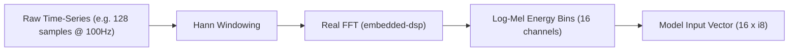

# End-to-End TinyML Guide: From Sensor to Microcontroller Inference

This guide covers the full workflow for developing, training, optimizing, and deploying deep learning models on resource-constrained embedded systems (`#![no_std]`, ARM Cortex-M, RISC-V, ESP32) using the **`embedded-nn`** platform ecosystem.

---

## 1. High-Level Architecture & Lifecycle

```mermaid
flowchart LR
    subgraph PHASE1 ["1. Ingestion"]
        MCU["Target MCU"] -->|nusb / Serial| Bridge["Sensor Ingest"]
        Bridge --> Dataset[("Labeled Dataset")]
    end

    subgraph PHASE2 ["2. DSP"]
        Dataset --> Filter["Windowing / Filtering"]
        Filter --> Spectrogram["FFT / Mel Filterbank"]
    end

    subgraph PHASE3 ["3. Training & QAT"]
        Spectrogram --> Burn["Burn Engine"]
        Burn --> QAT["s4 / s8 Quantization-Aware Training"]
    end

    subgraph PHASE4 ["4. Compiler & Arena"]
        QAT --> IR["Graph IR"]
        IR --> Planner["Static Memory Scheduler"]
    end

    subgraph PHASE5 ["5. Deployment"]
        Planner --> Codegen["embedded-nn-codegen"]
        Codegen --> Firmware["Target Firmware (#![no_std])"]
    end
```



---

## 2. Phase 1: Sensor Ingestion & Data Collection

Collecting high-quality real-world sensor data (IMU accelerometers, gyroscopes, audio microphones, PPG heart rate, environmental sensors) is the foundation of any TinyML project.

### Target Firmware Telemetry (MCU Side)
Stream sensor readings over USB CDC or bulk endpoints using the `embedded-nn-live` protocol:

```rust
use embedded_nn_live::protocol::{LiveMessage, SensorFrame};

// Inside your sensor read interrupt / timer loop (e.g. 100 Hz)
fn stream_sensor_sample(accel_x: f32, accel_y: f32, accel_z: f32, timestamp: u32) {
    let frame = SensorFrame {
        timestamp_ms: timestamp,
        channel_count: 3,
        values: vec![accel_x, accel_y, accel_z],
    };
    let msg = LiveMessage::SensorData(frame);
    // Transmit over UART / USB CDC / nusb bulk endpoint
    let json = msg.encode_json().unwrap();
    usb_serial_write(json.as_bytes());
}
```

### Studio Recording & Annotation
1. Launch **`embedded-nn-studio`**:
   ```bash
   cargo run -p embedded-nn-studio
   ```
2. Navigate to **Tab 1: Ingest & Sensors**.
3. Select your device port (e.g., `USB-CDC (ACM0)`).
4. Set the sample label (e.g., `gesture_swipe_left`, `gesture_tap`, `vibration_fault`).
5. Click **⏺ Record Sample** to capture labeled time-series frames directly into your training dataset.

---

## 3. Phase 2: DSP Preprocessing & Feature Extraction

Raw time-series data contains noise, high-frequency harmonics, and phase shifts. Preprocessing transforms raw signals into compact, representative feature matrices (e.g., FFT spectra or Mel-frequency bins), drastically shrinking the required neural network size.



### Preprocessing Parity
To avoid "train-test skew", the exact same DSP algorithms must execute on both the host (during dataset generation) and the microcontroller (during live inference):

```rust
use embedded_dsp::windowing::hann_window;
use embedded_dsp::fft::rfft_power_spectrum;

pub fn extract_features(raw_signal: &mut [f32], out_features: &mut [i8]) {
    // 1. Apply window function
    hann_window(raw_signal);

    // 2. Compute power spectrum
    let mut spectrum = [0.0f32; 64];
    rfft_power_spectrum(raw_signal, &mut spectrum);

    // 3. Quantize to s8 feature vector for embedded-nn
    for (i, bin) in spectrum.iter().take(16).enumerate() {
        out_features[i] = ((bin * 127.0).clamp(-128.0, 127.0)) as i8;
    }
}
```

---

## 4. Phase 3: Model Architecture & Quantization-Aware Training (QAT)

Embedded microcontrollers operate under strict SRAM (16KB–256KB) and Flash budgets. Choose architectures with low parameter counts:

| Model Type | Best For | Typical Parameters | Typical Flash (s4 / s8) |
| :--- | :--- | :--- | :--- |
| **Dense MLP** | Tabular, static classification | 500 – 4,000 | 250 B – 4 KB |
| **1D Temporal CNN** | IMU gestures, vibration monitoring | 1,000 – 10,000 | 500 B – 10 KB |
| **Depthwise Conv2D** | Tiny Vision (Person detect, OCR) | 10,000 – 100,000 | 5 KB – 50 KB |
| **SVDF / LSTM** | Keyword spotting, voice activity | 2,000 – 15,000 | 1 KB – 15 KB |

### Quantization Schemes in `embedded-nn`

1. **8-bit Signed Quantization (`s8`):**
   - High precision, standard fixed-point arithmetic (`Q31` multiplier + shift).
   - Zero-offset symmetric weights: $q = \text{clamp}(\text{round}(w / \text{scale}), -128, 127)$.
2. **4-bit Sub-Byte Quantization (`s4`):**
   - **50% Flash reduction** by packing two signed 4-bit weights ($[-8, 7]$) into each single byte.
   - Ideal for large fully connected and convolutional weight layers.

```rust
// Packing two s4 weights into a single byte
let packed_byte = embedded_nn::subbyte::pack_s4_pair(weight_0, weight_1);
```

---

## 5. Phase 4: Static Memory Planning (Zero Dynamic Allocation)

Traditional ML frameworks rely on dynamic memory allocators (`malloc`), leading to heap fragmentation and non-deterministic execution times.

`embedded-nn-compiler` uses an **Ahead-of-Time (AOT) Static Memory Arena Scheduler**:

```text
Time Step (Layer Execution) ──────────────────────────────────────────►
┌────────────────┬────────────────────────────────────────────────────┐
│ Layer 0 (Conv) │ Buffer A (In: 0..64)  -> Buffer B (Out: 64..192)   │
├────────────────┼────────────────────────────────────────────────────┤
│ Layer 1 (Pool) │ Buffer B (In: 64..192)-> Buffer A (Reused: 0..64)  │
├────────────────┼────────────────────────────────────────────────────┤
│ Layer 2 (FC)   │ Buffer A (In: 0..64)  -> Buffer B (Reused: 64..80) │
└────────────────┴────────────────────────────────────────────────────┘
SRAM Arena Peak Footprint: 192 Bytes total (instead of 336 Bytes naive sum)
```

The compiler computes:
- **Lifetime Start & End** for every intermediate activation tensor.
- **Physical Byte Offset** within a single static buffer `[u8; ARENA_SIZE]`.

---

## 6. Phase 5: Code Generation & Firmware Deployment

### Method A: Standalone Code Generation (`enn codegen`)

Use the `enn` CLI to emit pure `#![no_std]` Rust code:

```bash
cargo run -p embedded-nn-cli -- codegen \
  --model models/gesture_classifier.json \
  --name GestureClassifier \
  --out firmware/src/model.rs
```

### Method B: Compile-Time Macro (`#[embedded_nn_model]`)

Embed model weights and graph execution directly at compile time:

```rust
#![no_std]

use embedded_nn_macros::embedded_nn_model;

#[embedded_nn_model("models/gesture_classifier.json")]
pub struct GestureClassifier;

pub fn classify_motion(sensor_features: &[i8]) -> i8 {
    // 1. Allocate static arena buffer on stack or in .bss
    let mut arena = [0u8; GestureClassifier::ARENA_SIZE];

    // 2. Perform zero-allocation inference
    let output_probabilities = GestureClassifier::predict(sensor_features, &mut arena)
        .expect("Inference error");

    // 3. Find argmax class
    let mut best_class = 0;
    let mut max_val = i8::MIN;
    for (i, &score) in output_probabilities.iter().enumerate() {
        if score > max_val {
            max_val = score;
            best_class = i as i8;
        }
    }
    best_class
}
```

---

## 7. Phase 6: Hardware-in-the-Loop (HIL) Verification

To verify accuracy and profile latency on real target hardware:

1. **Cycle Counting:** Enable Cortex-M `DWT` cycle counter in firmware:
   ```rust
   let start_cycles = cortex_m::peripheral::DWT::cycle_count();
   let _ = GestureClassifier::predict(&features, &mut arena);
   let elapsed_cycles = cortex_m::peripheral::DWT::cycle_count() - start_cycles;
   ```
2. **HIL Telemetry:** Stream output logits and elapsed cycles back over USB to verify 100% bit-level agreement between host training predictions and MCU silicon execution.
