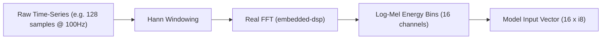

# End-to-End TinyML Guide: From Sensor to Microcontroller Inference

This guide covers the full workflow for developing, training, optimizing, and deploying deep learning models on resource-constrained embedded systems (`#![no_std]`, ARM Cortex-M, RISC-V, ESP32) using the **`embedded-nn`** platform ecosystem.

---

## 1. High-Level Architecture & Lifecycle

```mermaid
flowchart LR
    subgraph PHASE1 ["1. Ingestion"]
        MCU["Target MCU"] -->|nusb / Serial| Bridge["Sensor Ingest"]
        Bridge --> Dataset[("Labeled Dataset")]
    end

    subgraph PHASE2 ["2. DSP"]
        Dataset --> Filter["Windowing / Filtering"]
        Filter --> Spectrogram["FFT / Mel Filterbank"]
    end

    subgraph PHASE3 ["3. Training & QAT"]
        Spectrogram --> Burn["Burn Engine"]
        Burn --> QAT["s4 / s8 Quantization-Aware Training"]
    end

    subgraph PHASE4 ["4. Compiler & Arena"]
        QAT --> IR["Graph IR"]
        IR --> Planner["Static Memory Scheduler"]
    end

    subgraph PHASE5 ["5. Deployment"]
        Planner --> Codegen["embedded-nn-codegen"]
        Codegen --> Firmware["Target Firmware (#![no_std])"]
    end
```



---

## 2. Phase 1: Sensor Ingestion & Data Collection

Collecting high-quality real-world sensor data (IMU accelerometers, gyroscopes, audio microphones, PPG heart rate, environmental sensors) is the foundation of any TinyML project.

### Target Firmware Telemetry (MCU Side)

Stream packed `f32` samples with `Msg::SensorFrame` over vendor USB bulk using
[`embedded-nn-live`](LIVE_PROTOCOL.md). Do not send JSON over CDC.

Studio Ingest: **Refresh USB** then **Connect** to a `1209:e612` agent. Codegen: **Run on device**.

### Studio Recording & Annotation
1. Launch **`embedded-nn-studio`**:
   ```bash
   cargo run -p embedded-nn-studio
   ```
2. Navigate to **Tab 1: Ingest & Sensors**.
3. Select a USB-HS agent (or Simulated IMU Source).
4. Set the sample label (e.g., `gesture_swipe_left`, `gesture_tap`, `vibration_fault`).
5. Click **⏺ Record Sample** to capture labeled time-series frames directly into your training dataset.

### Importing Previously Captured Data
Captures that were logged elsewhere (on-device flash logs, a Python capture rig, a CSV
export) can be brought in as a JSON Lines file via **📂 Import Dataset File(s)** on the
same tab, then labeled per sample in the **Dataset Samples Explorer**. Validate a file
headlessly first with `enn dataset validate dataset.jsonl`.

See **[Dataset Import Format](DATASET_IMPORT_FORMAT.md)** for the schema.

---

## 3. Phase 2: DSP Preprocessing & Feature Extraction

Raw time-series data contains noise, high-frequency harmonics, and phase shifts. Preprocessing transforms raw signals into compact, representative feature matrices (e.g., FFT spectra or Mel-frequency bins), drastically shrinking the required neural network size.



### Preprocessing Parity
To avoid "train-test skew", the exact same DSP algorithms must execute on both the host (during dataset generation) and the microcontroller (during live inference):

```rust
use embedded_dsp::windowing::hann_window;
use embedded_dsp::fft::rfft_power_spectrum;

pub fn extract_features(raw_signal: &mut [f32], out_features: &mut [i8]) {
    // 1. Apply window function
    hann_window(raw_signal);

    // 2. Compute power spectrum
    let mut spectrum = [0.0f32; 64];
    rfft_power_spectrum(raw_signal, &mut spectrum);

    // 3. Quantize to s8 feature vector for embedded-nn
    for (i, bin) in spectrum.iter().take(16).enumerate() {
        out_features[i] = ((bin * 127.0).clamp(-128.0, 127.0)) as i8;
    }
}
```

---

## 4. Phase 3: Model Architecture & Quantization-Aware Training (QAT)

Embedded microcontrollers operate under strict SRAM (16KB–256KB) and Flash budgets. Choose architectures with low parameter counts:

| Model Type | Best For | Typical Parameters | Typical Flash (s4 / s8) |
| :--- | :--- | :--- | :--- |
| **Dense MLP** | Tabular, static classification | 500 – 4,000 | 250 B – 4 KB |
| **1D Temporal CNN** | IMU gestures, vibration monitoring | 1,000 – 10,000 | 500 B – 10 KB |
| **Depthwise Conv2D** | Tiny Vision (Person detect, OCR) | 10,000 – 100,000 | 5 KB – 50 KB |
| **SVDF / LSTM** | Keyword spotting, voice activity | 2,000 – 15,000 | 1 KB – 15 KB |

### Quantization Schemes in `embedded-nn`

1. **8-bit Signed Quantization (`s8`):**
   - High precision, standard fixed-point arithmetic (`Q31` multiplier + shift).
   - Zero-offset symmetric weights: $q = \text{clamp}(\text{round}(w / \text{scale}), -128, 127)$.
2. **4-bit Sub-Byte Quantization (`s4`):**
   - **50% Flash reduction** by packing two signed 4-bit weights ($[-8, 7]$) into each single byte.
   - Ideal for large fully connected and convolutional weight layers.

```rust
// Packing two s4 weights into a single byte
let packed_byte = embedded_nn::subbyte::pack_s4_pair(weight_0, weight_1);
```

---

## 5. Phase 4: Static Memory Planning (Zero Dynamic Allocation)

Traditional ML frameworks rely on dynamic memory allocators (`malloc`), leading to heap fragmentation and non-deterministic execution times.

`embedded-nn-compiler` uses an **Ahead-of-Time (AOT) Static Memory Arena Scheduler**:

```text
Time Step (Layer Execution) ──────────────────────────────────────────►
┌────────────────┬────────────────────────────────────────────────────┐
│ Layer 0 (Conv) │ Buffer A (In: 0..64)  -> Buffer B (Out: 64..192)   │
├────────────────┼────────────────────────────────────────────────────┤
│ Layer 1 (Pool) │ Buffer B (In: 64..192)-> Buffer A (Reused: 0..64)  │
├────────────────┼────────────────────────────────────────────────────┤
│ Layer 2 (FC)   │ Buffer A (In: 0..64)  -> Buffer B (Reused: 64..80) │
└────────────────┴────────────────────────────────────────────────────┘
SRAM Arena Peak Footprint: 192 Bytes total (instead of 336 Bytes naive sum)
```

The compiler computes:
- **Lifetime Start & End** for every intermediate activation tensor.
- **Physical Byte Offset** within a single static buffer `[u8; ARENA_SIZE]`.

### Silicon Profiling: Total vs. Available SRAM

Studio's **Arena** tab checks the planned arena against a selected target. Physical SRAM is not
the same as SRAM your model can use, so the profiler reports the split explicitly:

```text
SRAM total  -  radio/stack reserve  =  available to the arena
```

The arena's pass/fail verdict and utilization gauge are always computed against the **available**
figure, never the total. Targets that carry no protocol stack in their profile reserve `0 KB`, so
available equals total for them.

| Target | Core | Clock | Flash | SRAM (total) | Default stack reserve | Rust target |
| :--- | :--- | :--- | :--- | :--- | :--- | :--- |
| STM32F401RE | Cortex-M4F | 84 MHz | 512 KB | 64 KB | 0 KB | `thumbv7em-none-eabihf` |
| nRF52840 | Cortex-M4F | 64 MHz | 1024 KB | 256 KB | 0 KB | `thumbv7em-none-eabihf` |
| RP2040 | Dual Cortex-M0+ | 133 MHz | 2048 KB | 264 KB | 0 KB | `thumbv6m-none-eabi` |
| RP2350 | Dual Cortex-M33 | 150 MHz | 4096 KB | 520 KB | 0 KB | `thumbv8m.main-none-eabihf` |
| ESP32-S3 | Dual Xtensa LX7 | 240 MHz | 8192 KB | 512 KB | 0 KB | `xtensa-esp32s3-none-elf` |
| **STM32WBA65RI** | Cortex-M33 (FPU + DSP) | 100 MHz | 2048 KB | 512 KB | **192 KB (editable)** | `thumbv8m.main-none-eabihf` |

For the STM32WBA65RI, the reserve is editable because the amount of SRAM a BLE controller/host
and its buffers consume depends on how the stack is configured. The 192 KB default is a
mid-range starting point, not a datasheet constant — set it to your firmware's actual linker
budget. Studio keeps the value per target, so switching targets and returning preserves your
edit. With the default, the arena is judged against 320 KB available out of 512 KB total.

### `+dsp` on the STM32WBA65RI

The WBA65RI's Cortex-M33 implements the Armv8-M DSP extension, and the reference firmware in
[`examples/stm32wba65ri`](../examples/stm32wba65ri) builds for `thumbv8m.main-none-eabihf` with
`-C target-feature=+dsp`. Stable Rust accepts the flag but emits:

```text
warning: unstable feature specified for `-Ctarget-feature`: `dsp`
         this feature is not stably supported; its behavior can change in the future
```

The warning is expected. The generated kernels are portable and build correctly without the
flag; enabling it only lets DSP-accelerated implementations be selected where available.

---

## 6. Phase 5: Code Generation & Firmware Deployment

### Method A: Standalone Code Generation (`enn codegen`)

Use the `enn` CLI to emit pure `#![no_std]` Rust code:

```bash
cargo run -p embedded-nn-cli -- codegen \
  --model models/gesture_classifier.json \
  --name GestureClassifier \
  --out firmware/src/model.rs
```

### Method B: Compile-Time Macro (`#[embedded_nn_model]`)

Embed model weights and graph execution directly at compile time:

```rust
#![no_std]

use embedded_nn_macros::embedded_nn_model;

#[embedded_nn_model("models/gesture_classifier.json")]
pub struct GestureClassifier;

pub fn classify_motion(sensor_features: &[i8]) -> i8 {
    // 1. Allocate static arena buffer on stack or in .bss
    let mut arena = [0u8; GestureClassifier::ARENA_SIZE];

    // 2. Perform zero-allocation inference
    let output_probabilities = GestureClassifier::predict(sensor_features, &mut arena)
        .expect("Inference error");

    // 3. Find argmax class
    let mut best_class = 0;
    let mut max_val = i8::MIN;
    for (i, &score) in output_probabilities.iter().enumerate() {
        if score > max_val {
            max_val = score;
            best_class = i as i8;
        }
    }
    best_class
}
```

---

## 7. Phase 6: Hardware-in-the-Loop (HIL) Verification

To verify accuracy and profile latency on real target hardware:

1. **Cycle Counting:** Enable Cortex-M `DWT` cycle counter in firmware:
   ```rust
   let start_cycles = cortex_m::peripheral::DWT::cycle_count();
   let _ = GestureClassifier::predict(&features, &mut arena);
   let elapsed_cycles = cortex_m::peripheral::DWT::cycle_count() - start_cycles;
   ```
2. **HIL Telemetry:** Stream output logits and elapsed cycles back over USB to verify 100% bit-level agreement between host training predictions and MCU silicon execution.

---

## 8. Reference Examples Library

Explore complete, runnable reference projects across hardware architectures and TinyML modalities:

- **[Audio Keyword Spotting (KWS)](../examples/keyword-spotting)**: On-device Mel filterbank DSP extraction & 112 -> 32 -> 4 INT8 wake-word detection.
- **[Industrial Vibration Anomaly Detection & Safety](../examples/vibration-anomaly)**: Autoencoder MSE reconstruction scoring, Mahalanobis baseline distance, and ISO 26262 Flash CRC32 & arena canary integrity.
- **[6-DOF IMU Gesture Recognition](../examples/imu-gesture)**: Accelerometer/Gyroscope temporal windowing with compile-time `#[embedded_nn_model]` embedding.
- **[Sub-Byte 4-Bit & Codebook LUT Quantization](../examples/subbyte-quantization)**: 50% Flash memory compression with packed 4-bit nibbles and nonlinear K-Means codebook tables.
- **[Raspberry Pi Pico (RP2040) Deployment](../examples/rp2040-pico)**: Dual Cortex-M0+ bare-metal `#![no_std]` firmware with GPIO LED inference feedback.
- **[C99 Bare-Metal Deployment](../examples/c99-baremetal)**: Standalone C99 header-only deployment with zero external runtime dependencies.
- **[STM32WBA65 Wireless MCU](../examples/stm32wba65ri)**: Cortex-M33 DSP-accelerated gesture firmware with WinUSB HIL streaming and SD card logging.
- **[QEMU LM3S6965 Semihosting](../examples/qemu-lm3s6965)**: Automated headless CI/CD semihosting tests running neural network inference in QEMU.

