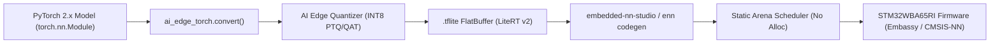

# PyTorch to Microcontroller (LiteRT & `embedded-nn`) Workflow

This guide details the complete, production-ready pipeline for training a TinyML model in **PyTorch 2.x**, exporting and quantizing it using Google's **LiteRT** (`ai-edge-torch`), and compiling it into zero-allocation `#![no_std]` Rust firmware for the **STM32WBA65RI**.

---

## 1. Pipeline Overview



---

## 2. Step 1: Train & Export with `ai-edge-torch` (LiteRT)

Install LiteRT PyTorch tools:
```bash
pip install ai-edge-torch ai-edge-quantizer torch
```

Export your PyTorch model to an optimized INT8 `.tflite` model:

```python
# export_gesture_cnn.py
import torch
import torch.nn as nn
import ai_edge_torch
from ai_edge_quantizer import quantizer

class Gesture1DCNN(nn.Module):
    def __init__(self, num_classes=3):
        super().__init__()
        # Input shape: [1, 3, 128] (3-axis accelerometer, 128 time samples)
        self.conv1 = nn.Conv1d(in_channels=3, out_channels=8, kernel_size=3, padding=1)
        self.relu = nn.ReLU()
        self.pool = nn.MaxPool1d(kernel_size=2, stride=2)
        self.fc = nn.Linear(8 * 64, num_classes)

    def forward(self, x):
        x = self.pool(self.relu(self.conv1(x)))
        x = torch.flatten(x, 1)
        return self.fc(x)

# 1. Instantiate and train model
model = Gesture1DCNN(num_classes=3).eval()
sample_input = (torch.randn(1, 3, 128),)

# 2. Convert and quantize to INT8 via LiteRT
edge_model = ai_edge_torch.convert(model, sample_input)
edge_model.export("gesture_cnn_int8.tflite")
print("Exported LiteRT INT8 model: gesture_cnn_int8.tflite")
```

---

## 3. Step 2: Import into `embedded-nn`

You can import the exported `.tflite` model via the **CLI** or **Studio GUI**:

### Option A: `enn` Command Line
```bash
# Generate zero-allocation Rust code with static arena plan
cargo run -p embedded-nn-cli -- codegen gesture_cnn_int8.tflite \
    --name GestureCnnNet \
    --target-profile stm32wba65ri \
    --out examples/stm32wba65ri/src/model.rs
```

### Option B: Interactive Studio GUI
```bash
cargo run -p embedded-nn-studio
```
1. Click **Open .tflite** in the header.
2. Inspect the **Arena** tab for SRAM memory lifetime intervals.
3. Switch to **7. 🔬 Live Inspector** to monitor latency and layer activations in real time over USB.

---

## 4. Step 3: Run Zero-Allocation Inference on STM32WBA65

In your Embassy application (`examples/stm32wba65ri/src/bin/data_collector.rs`):

```rust
use crate::model::GestureCnnNet;

// Static SRAM arena scheduled at compile time
static mut ARENA: [u8; GestureCnnNet::ARENA_SIZE] = [0u8; GestureCnnNet::ARENA_SIZE];

#[embassy_executor::task]
async fn inference_task() {
    let mut quantized_input = [0i8; GestureCnnNet::INPUT_DIM];
    let mut logits = [0i8; GestureCnnNet::OUTPUT_DIM];

    // Read sensor input, normalize, and quantize
    // ...
    
    // Run zero-alloc prediction (deterministic microsecond latency)
    let arena = unsafe { &mut ARENA };
    let prediction = GestureCnnNet::predict(&quantized_input, arena).unwrap();
    
    defmt::info!("Class logits: {:?}", prediction);
}
```
