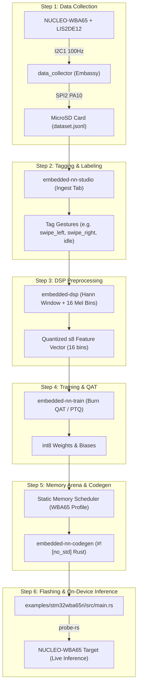

# STM32WBA65RI TinyML End-to-End Instruction Manual
## Gesture Recognition with LIS2DE12 Accelerometer, MicroSD Logging, DSP, QAT, and `#![no_std]` Deployment

This manual provides complete step-by-step instructions for building a TinyML gesture recognition application from scratch using the **NUCLEO-WBA65RI**, **LR1110 Shield** (LIS2DE12 accelerometer + W25Q32BV Flash), and **DM-TFT28-116 Shield** (MicroSD cradle).

---

## Architecture Overview



---

## 1. Hardware Assembly & Jumper Settings

Stack the three boards onto each other using their standard Arduino Uno V3 expansion headers:
1. **Base Board**: STM32WBA65 Nucleo-64 (`MB1801` + `MB2130`).
2. **Middle Shield**: LR1110 Evaluation Shield (`PCB_E516V03A`).
3. **Top Shield**: DM-TFT28-116 2.8" Display & MicroSD Module.

### Critical Switch & Jumper Configurations
- **DM-TFT28-116 DIP Switch `SW2`**: Set positions **1, 2, and 3 to ON**. This routes Arduino header pins `D11` (MOSI), `D12` (MISO), and `D13` (SCK) through the `74HC541` level shifter to the MicroSD cradle.
- **Power Selector `JP1` on Nucleo**: Position `[1-2]` (`5V_STLK`) when powering via ST-LINK USB-C.
- **Nucleo `JP2` (IDD jumper)**: Fitted (ON).

### Pin Interconnect Mapping

| Bus / Signal | Nucleo-WBA65 Pin | Arduino Header | Peripheral / Function |
| :--- | :--- | :--- | :--- |
| **I2C1 SCL** | `PB2` | `D15` | LIS2DE12 SCL (Pin 1) |
| **I2C1 SDA** | `PB1` | `D14` | LIS2DE12 SDA (Pin 4) |
| **SPI2 SCK** | `PB10` | `D13` | MicroSD CLK / Flash CLK |
| **SPI2 MISO** | `PA9` | `D12` | MicroSD MISO / Flash DO |
| **SPI2 MOSI** | `PC3` | `D11` | MicroSD MOSI / Flash DI |
| **SD Card CS** | `PA10` | `D8` | MicroSD `DAT3/CD` Chip Select |
| **Flash CS** | `PA3` | `D4` | W25Q32BV `/CS` Chip Select |
| **User Button** | `PC13` | `B1` | Capture Trigger (EXTI13) |
| **Status LEDs** | `PD8` (Blue), `PC4` (Green), `PB8` (Red) | — | System & Capture Indicators |

---

## 2. Step 1: Collect Sensor Data

The `data_collector` application runs an asynchronous Embassy loop that acquires 3-axis accelerometer data and persists records in canonical JSON Lines (`.jsonl`) format.

### Flash and Run Data Collector

```bash
# Navigate to the WBA65 example directory
cd examples/stm32wba65ri

# Flash and stream logs via cargo (configured with probe-rs runner)
cargo run --bin data_collector
```

### Performing Captures
1. The **Green LED (`LD2`)** turns ON once the LIS2DE12 and W25Q32BV are detected.
2. Hold the board in your hand and perform a gesture (e.g., swipe left, swipe right, tap).
3. Press **User Button B1 (`PC13`)** to record a 128-sample burst at 100 Hz (1.28-second window).
4. The **Blue LED (`LD1`)** illuminates during capture.
5. The record is serialized and written to `dataset.jsonl` on the MicroSD card:

```json
{"sample_id":"sample_0001","label":null,"sample_rate_hz":100.0,"channel_names":["x","y","z"],"waveform":[[0.012,0.004,0.988],[0.016,0.008,0.992],...]}
```

---

## 3. Step 2: Validate, Import, and Tag Dataset

### Validate Dataset File Headlessly

```bash
enn dataset validate dataset.jsonl
```
*Outputs sample count, channel layout confirmation (`["x","y","z"]`), and label statistics.*

### Import & Label in Studio GUI

1. Launch Studio:
   ```bash
   cargo run -p embedded-nn-studio
   ```
2. Navigate to **Tab 1: Ingest & Sensors**.
3. Click **📂 Import Dataset File(s)** and select `dataset.jsonl`.
4. The multi-channel time series is automatically converted into scalar magnitude vectors ($\sqrt{x^2 + y^2 + z^2}$).
5. In the **Dataset Samples Explorer** table at the bottom of the tab, use the class dropdown to tag each sample (e.g. `swipe_left`, `swipe_right`, `shake`, `idle`).

---

## 4. Step 3: DSP Preprocessing & Feature Extraction

Raw IMU waveforms must be transformed into compact frequency-domain features before being fed to the neural network.

1. Navigate to **Tab 2: DSP & Preprocessing**.
2. Configure feature parameters:
   - **Window Function**: Hann Window.
   - **Filterbank Channels**: 16 Log-Mel frequency channels.
   - **Output Format**: Quantized `s8` integer feature vectors (`[i8; 16]`).
3. Click **Extract Dataset Features**. Studio generates the exact DSP pipeline matching [`examples/stm32wba65ri/src/on_device_dsp.rs`](file:///home/usuario/Projects/my-repos/embedded-nn/examples/stm32wba65ri/src/on_device_dsp.rs) to prevent train-test skew.

---

## 5. Step 4: Model Architecture & Training (QAT)

1. Navigate to **Tab 3: Training & Quantization**.
2. Select Model Architecture:
   - **Dense MLP**: 16 inputs $\rightarrow$ 32 Hidden (ReLU) $\rightarrow$ $N$ Classes.
   - **Tiny Conv1D**: 1D Convolution over spectrogram frames.
3. Select Quantization Mode:
   - **int8 QAT (Quantization-Aware Training)**: Simulates 8-bit integer truncation in forward pass.
4. Click **🚀 Start Training**:
   - Review validation accuracy, loss curves, confusion matrix, and activation weight distributions.
5. Export model checkpoint to JSON (e.g., `models/gesture_mlp.json`).

---

## 6. Step 5: Static Memory Planning & Zero-Allocation Codegen

1. Navigate to **Tab 4: Arena & Memory**.
2. Select Target: **STM32WBA65RI**:
   - Core: Arm Cortex-M33 @ 100 MHz
   - Flash: 2048 KB | Total SRAM: 512 KB | BLE Reserve: 192 KB
3. The static memory scheduler optimizes buffer reuse and calculates the exact byte size of `ARENA_SIZE` required for intermediate layer tensors.
4. Navigate to **Tab 5: Codegen & Export**.
5. Click **Generate `#![no_std]` Rust Code**.
6. Save the generated file to [`examples/stm32wba65ri/src/gesture.rs`](file:///home/usuario/Projects/my-repos/embedded-nn/examples/stm32wba65ri/src/gesture.rs).

---

## 7. Step 6: Deploy to STM32WBA65RI & Run Inference

The main application ([`examples/stm32wba65ri/src/main.rs`](file:///home/usuario/Projects/my-repos/embedded-nn/examples/stm32wba65ri/src/main.rs)) combines the sensor driver, DSP extraction, and the compiled model into a zero-allocation runtime.

### Firmware Inference Code Structure

```rust
// 1. Capture accelerometer buffer
let mut dsp_features = [0i8; 16];
on_device_dsp::first_frame_s8(&raw_imu_signal, &mut dsp_features);

// 2. Allocate static scratch arena on stack
let mut gesture_arena = [0u8; gesture::GestureMlp::ARENA_SIZE];

// 3. Execute zero-allocation neural network inference with cycle benchmarking
let start_cycles = DWT::cycle_count();
let prediction = gesture::GestureMlp::predict(&dsp_features, &mut gesture_arena);
let elapsed_cycles = DWT::cycle_count().wrapping_sub(start_cycles);

// 4. Output classification results
match prediction {
    Ok(logits) => {
        let predicted_class = if logits[0] >= logits[1] { 0 } else { 1 };
        defmt::info!("Classified gesture: class {} in {} CPU cycles (~{} us)", 
            predicted_class, elapsed_cycles, elapsed_cycles / 100);
    }
    Err(e) => defmt::error!("Inference error: {}", e),
}
```

### Build and Run Live on Hardware

```bash
cd examples/stm32wba65ri

# Compile and flash to target board
cargo run --bin embedded-nn-stm32wba65ri
```

### Live HIL (Hardware-In-The-Loop) Verification over USB-HS

To test and benchmark inferences directly from your PC host over high-speed USB:

```bash
# Flash the USB HIL agent
cargo run --features hil-usb --bin hil_agent

# Ping target agent over USB bulk
enn hil ping

# Run remote hardware inference and inspect internal activations
enn hil infer --input 64
```
