## **Introduction**

The [NUCLEO-WBA65RI](https://www.st.com/en/product/nucleo-wba65ri?ecmp=tt9470_gl_link_feb2019&rt=um&id=UM3448) STM32 Nucleo-64 board, based on the MB1801 mezzanine board and the MB2130 MCU RF board, is a wireless and ultra‑low‑power board embedding a powerful and ultra‑low‑power radio compliant with the Bluetooth® LE, IEEE 802.15.4-2015 PHY and MAC, supporting Thread, Matter, and Zigbee®.

A user USB Type-C® is also provided for easy connection with other devices.

The ARDUINO® Uno V3 connectivity support and the ST morpho headers allow the easy expansion of the functionality of the STM32 Nucleo open development platform with a wide choice of specialized shields.

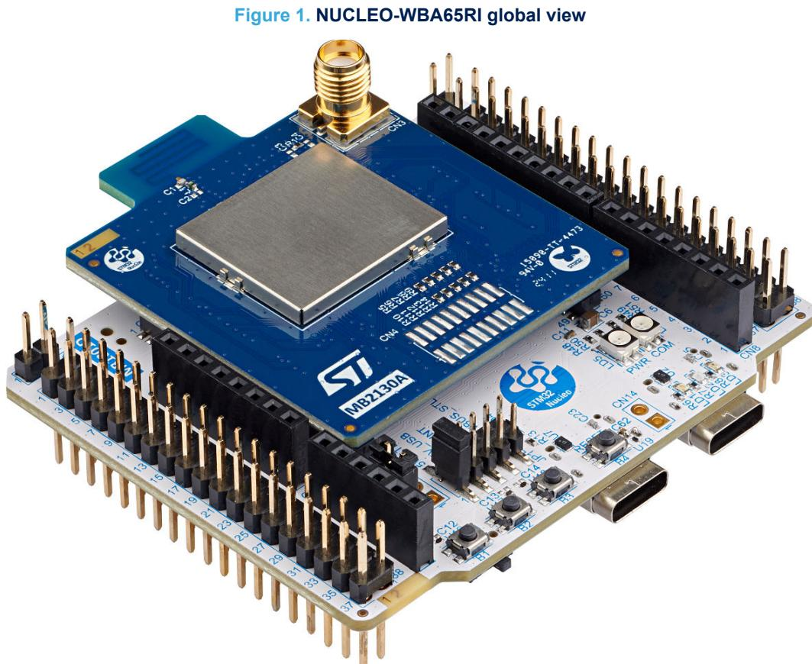

*Picture is not contractual.*

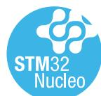

# STM32WBA Nucleo-64 board (MB1801 and MB2130)

## **1 Features**

- Ultra‑low‑power wireless [STM32WBA65RIV7](https://www.st.com/en/product/stm32wba65ri?ecmp=tt9470_gl_link_feb2019&rt=um&id=UM3448) microcontroller based on the Arm® Cortex®‑M33 core, featuring 2 Mbytes of flash memory and 512 Kbytes of SRAM in a VFQFPN68 package
- MCU RF board (MB2130):
  - 2.4 GHz RF transceiver supporting Bluetooth® LE
  - Bluetooth® LE:
    - LE 2M
    - LE Coded
    - Direction‑finding
    - LE Power control
    - Isochronous channels
    - Extended advertising
    - Periodic advertising
    - LE Secure connections
    - LE Audio
    - Mesh networking
    - Core specification v6.0
  - IEEE 802.15.4-2015 PHY and MAC, supporting Thread, Matter, and Zigbee®
  - Arm® Cortex®‑M33 CPU with Arm® TrustZone®, MPU, DSP, and FPU
  - Integrated PCB antenna
- Mezzanine board (MB1801):
  - Three user LEDs
  - Three user push-buttons and one reset push-button
  - Board connectors:
    - User USB Type-C®
    - USB Type-C® for debugging purpose
    - ARDUINO® Uno V3 expansion connector
    - ST morpho headers for full access to all STM32 I/Os
- Flexible power-supply options: ST-LINK USB VBUS or external sources
- On-board STLINK-V3EC debugger/programmer with USB re-enumeration capability: mass storage, Virtual COM port, and debug port
- Comprehensive free software libraries and examples available with the [STM32CubeWBA](https://www.st.com/en/product/stm32cubewba?ecmp=tt9470_gl_link_feb2019&rt=um&id=UM3448) MCU Package
- Support of a wide choice of Integrated Development Environments (IDEs) including IAR Embedded Workbench®, MDK-ARM, and STM32CubeIDE

*Note: Arm and TrustZone are registered trademarks of Arm Limited (or its subsidiaries) in the US and/or elsewhere.*

# **2 Ordering information**

To order the NUCLEO-WBA65RI board, refer to Table 1. Additional information is available from the datasheet and reference manual of the target microcontroller.

**Table 1. List of available products**

| Order code     | Board reference | Target STM32   |
|----------------|-----------------|----------------|
| NUCLEO-WBA65RI | MB1801 (1)      |                |
|                | MB2130 (2)      | STM32WBA65RIV7 |

- *1. Mezzanine board*
- *2. MCU RF board*

## **2.1 Codification**

The meaning of the codification is explained in Table 2.

#### **Table 2. Codification explanation**

| NUCLEO-XXXYYZT | Description                                | Example: NUCLEO-WBA65RI    |
|----------------|--------------------------------------------|----------------------------|
| XXX            | MCU series in STM32 32-bit Arm Cortex MCUs | STM32WBA series            |
| YY             | MCU product line in the series             | STM32WBA64/65 product line |

## **3 Development environment**

## **3.1 System requirements**

- Multi‑OS support: Windows® 10, Linux® 64-bit, or macOS®
- USB Type-A or USB Type-C® to USB Type-C® cable *Note: macOS® is a trademark of Apple Inc., registered in the U.S. and other countries and regions. Linux® is a registered trademark of Linus Torvalds. Windows is a trademark of the Microsoft group of companies.*

## **3.2 Development toolchains**

- IAR Systems® IAR Embedded Workbench®(1)
- Keil® MDK-ARM(1)
- STMicroelectronics STM32CubeIDE
- *1. On Windows® only.*

## **3.3 Demonstration software**

The demonstration software, included in the STM32Cube MCU Package corresponding to the on-board microcontroller, is preloaded in the STM32 flash memory for easy demonstration of the device peripherals in standalone mode. The latest versions of the demonstration source code and associated documentation can be downloaded from *[www.st.com](https://www.st.com)*.

## **3.4 CAD resources**

All board design resources, including schematics, CAD databases, manufacturing files, and the bill of materials, are available from the [NUCLEO-WBA65RI](https://www.st.com/en/product/nucleo-wba65ri?ecmp=tt9470_gl_link_feb2019&rt=um&id=UM3448) product page at *[www.st.com](https://www.st.com)*.

## **4 Conventions**

Table 3 provides the conventions used for the ON and OFF settings in the present document.

**Table 3. ON/OFF convention**

| Convention            | Definition                             |
|-----------------------|----------------------------------------|
| Jumper JPx ON         | Jumper fitted                          |
| Jumper JPx OFF        | Jumper not fitted                      |
| Jumper JPx [1-2]      | Jumper fitted between pin 1 and pin 2  |
| Solder bridge SBx ON  | SBx connections closed by 0 Ω resistor |
| Solder bridge SBx OFF | SBx connections left open              |
| Resistor Rx ON        | Resistor soldered                      |
| Resistor Rx OFF       | Resistor not soldered                  |
| Capacitor Cx ON       | Capacitor soldered                     |
| Capacitor Cx OFF      | Capacitor not soldered                 |

## **5 Safety recommendations**

## **5.1 Targeted audience**

This product targets users with at least basic electronics or embedded software development knowledge such as engineers, technicians, or students. This board is not a toy and is not suited for use by children.

## **5.2 Handling the board**

This product contains a bare printed circuit board and like all products of this type, the user must be careful about the following points:

- The connection pins on the board might be sharp. Be careful when handling the board to avoid hurting yourself
- This board contains static‑sensitive devices. To avoid damaging it, handle the board in an ESD‑proof environment.
- While powered, do not touch the electric connections on the board with your fingers or anything conductive. The board operates at a voltage level that is not dangerous, but components might be damaged when shorted.
- Do not put any liquid on the board and avoid operating the board close to water or at a high humidity level.
- Do not operate the board if dirty or dusty.

## **6 Quick start**

This section describes how to start development quickly using NUCLEO-WBA65RI.

To use the product, you must accept the evaluation product license agreement from the [www.st.com/epla](https://www.st.com/epla) webpage.

Before the first use, make sure that no damage occurred to the board during shipment:

- All socketed components must be firmly secured in their sockets.
- Nothing must be loose in the board blister.

The Nucleo board is an easy-to-use development kit to evaluate quickly and start development with an STM32 microcontroller in a VFQFPN68 package.

## **6.1 Getting started**

Follow the sequence below to configure the NUCLEO-WBA65RI board and launch the demonstration application (refer to [Figure 3](#page-8-0) and [Figure 4](#page-9-0) for component location):

- 1. Check jumper positions on board: JP2 ON, JP1 on 5V\_STLK.
- 2. Check that the power switch (SW1) is in the default position.
- 3. Install the ST Bluetooth® LE sensor mobile application on a Bluetooth® LE compatible mobile device from the App Store or Google Play.
- 4. Connect the Nucleo board to a PC with a USB Type-A or USB Type-C® to USB Type-C® cable through the USB\_STLK USB connector (CN15).
- 5. Use the ST Bluetooth® LE sensor mobile application to detect the STM32WBA P2P server (P2PSRV) and connect it. The smartphone application displays the service and characteristics of the device.
- 6. Pushing the button (B1) on the board toggles the alarm on the smartphone display. On the smartphone, push the lamp to switch ON/OFF the Nucleo board blue LED (LD1).

## **7 Hardware layout and configuration**

NUCLEO-WBA65RI is designed around the STM32WBA65RI. The design includes a mezzanine board and an MCU RF board. The hardware block diagram in Figure 2 illustrates the connection between STM32WBA65RI and peripherals (ARDUINO® Uno V3 connectors, ST morpho connector, and embedded ST-LINK). [Figure 3](#page-8-0) and [Figure 4](#page-9-0) help users locate these features on the NUCLEO-WBA65RI board. The mechanical dimensions of the NUCLEO-WBA65RI product are shown in [Figure 5](#page-10-0) and [Figure 6.](#page-11-0)

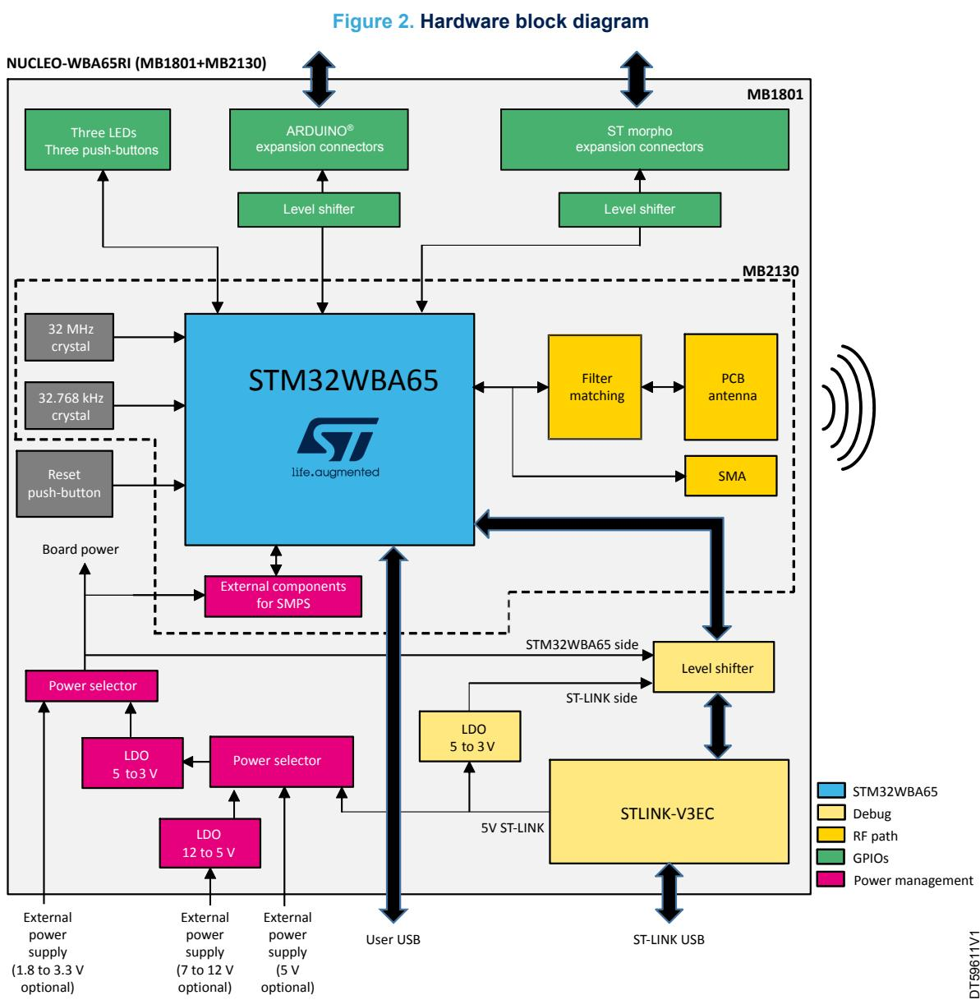

#### **Figure 3. NUCLEO-WBA65RI PCB top view**

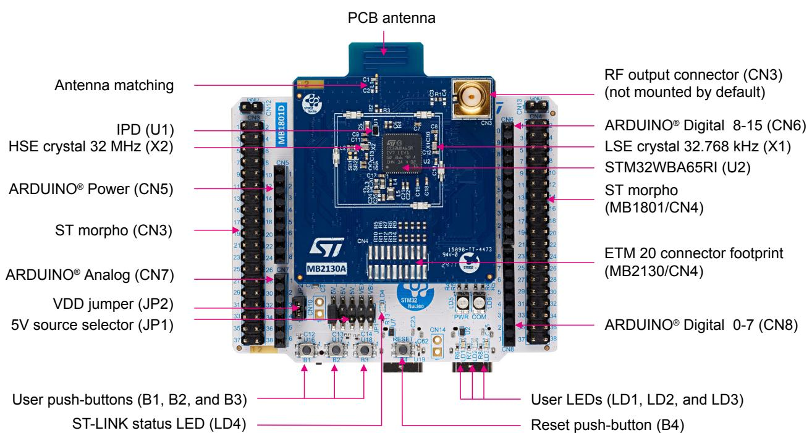

**Figure 4. NUCLEO-WBA65RI PCB bottom view of mezzanine board (MB1801)**

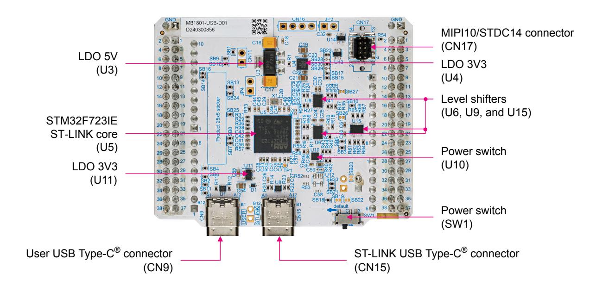

**Figure 5. NUCLEO-WBA65RI (MB1801) mechanical dimensions (in millimeters)**

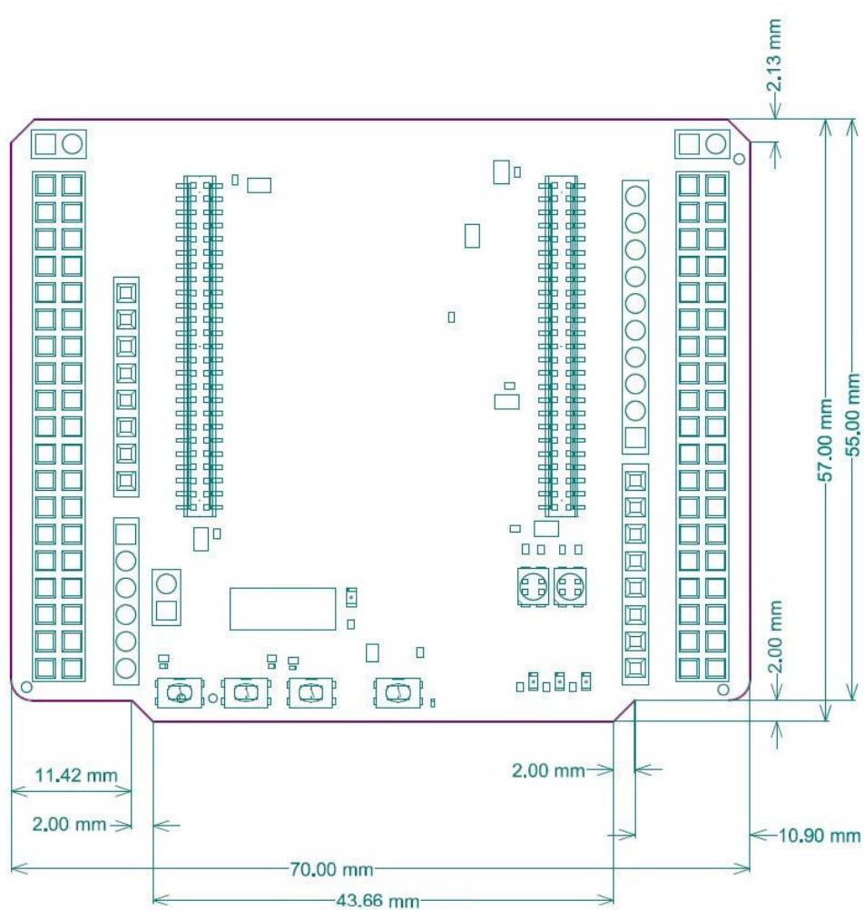

**Figure 6. NUCLEO-WBA65RI (MB2130) mechanical dimensions (in millimeters)**

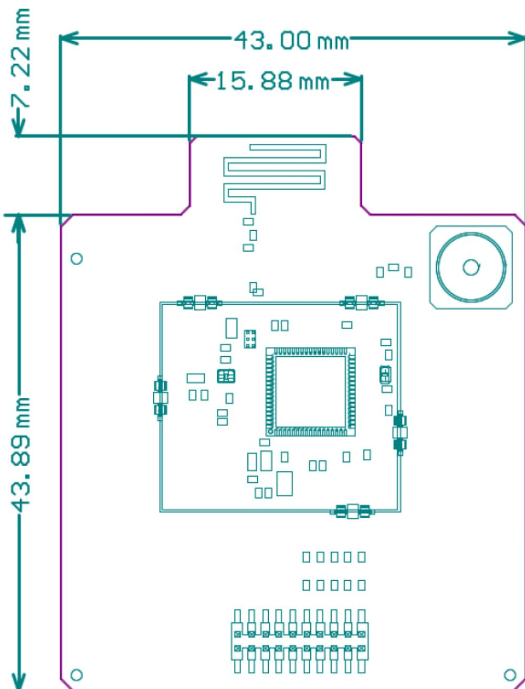

## **7.1 Power supply**

#### **7.1.1 General description**

By default, the STM32WBA65RI embedded on this Nucleo board is supplied by 3V3 but the board proposes many possibilities to supply the module. In fact, at first, the 3V3 can come from ST-LINK USB, ARDUINO®, or ST morpho connectors. Moreover, STM32WBA65RI can be supplied by an external source (between 1.8 and 3.3 V). Thanks to level shifters, debugging by embedded ST-LINK is always possible even if the supply voltage of the target is different than 3V3 (ST-LINK supply). Figure 7 shows the power tree. Moreover, this figure also shows the default state of the jumpers and the solder bridges.

*Note: The product must be supplied by a voltage source or auxiliary equipment that complies with EN 62368-1:2014+A11:2017 or the standard that replaces it. It must also be a safety extralow voltage (SELV) with limited power capability.*

**Figure 7. STM32WBA65RI power tree**

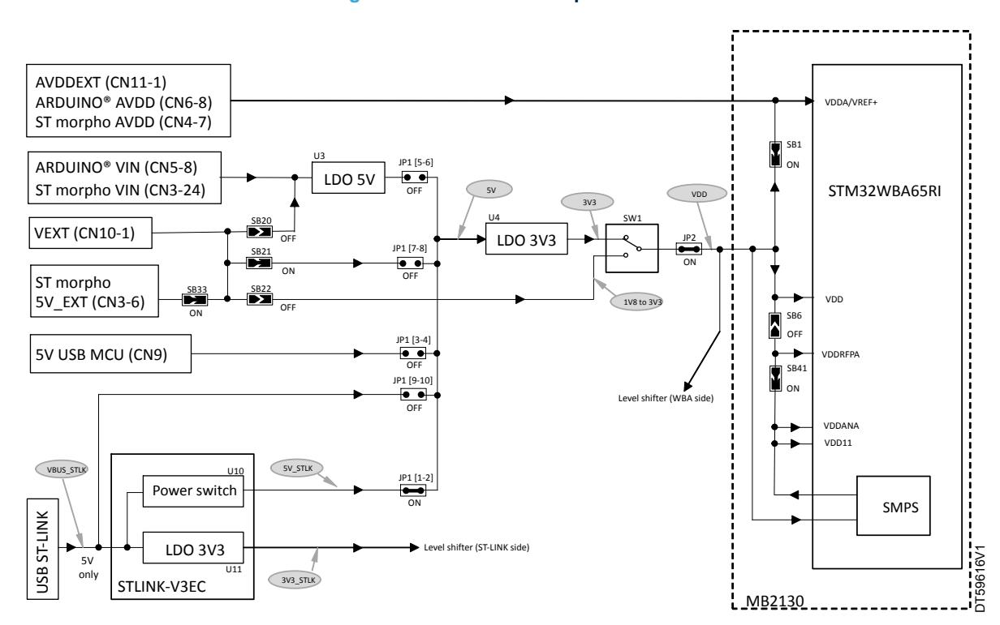

#### **7.1.2 7 to 12 V power supply**

A 7 to 12 V DC power source can power NUCLEO-WBA65RI. There are three accesses for this type of level:

- Pin VIN of the ARDUINO® connector (CN5-8). It is possible to apply until +12 V on this pin or use an ARDUINO® shield, which can deliver this type of voltage on the VIN pin.
- Pin VIN of the ST morpho connector (CN3-24). It is possible to apply until +12 V on this pin like for the ARDUINO® connection.
- External input (CN10). Be careful, in this case, the states of the jumpers and solder bridge are critical. Verify these states in [Table 4](#page-14-0).

These sources are connected to a linear low‑drop voltage regulator (U2). The output of this regulator (5 V) is a potential source of the 5V signal (refer to details in the next section).

#### **7.1.3 5 V power supply**

A 5 V DC power source can power NUCLEO-WBA65RI. The 5 V can come from several connectors:

- External input (VEXT, CN10). Be careful, in this case, the states of the jumpers and solder bridge are critical. Refer to [Table 4.](#page-14-0)
- 5V\_EXT from ST morpho connector (CN3-6 of MB1801)
- VIN (7-12 V) input through the voltage regulator (U2). Refer to Section 7.1.2: 7 to 12 V power supply.
- USB ST-LINK can supply the board directly (VBUS\_STLK) or through the monitoring of STLINK-V3EC.
- 5V\_USB coming from the user USB connector (CN9).

The jumper (JP1) selects the 5V source. [Table 4](#page-14-0) shows the configuration to apply the selected source.

Depending on the current needed on the devices connected to the USB port, and the board itself, power limitations can prevent the system from working as expected. The user must ensure that NUCLEO-WBA65RI is supplied with the correct power source depending on the current need.

**Table 4. Power supply selector (JP1) description**

| Jumper Setting | Configuration                                  |
|----------------|------------------------------------------------|
| 5V _STLK       |                                                |
| 5V _USB        |                                                |
| 5V             | _INT                                           |
|                | VBUS _STLK                                     |
|                | ST-LINK USB Type-C ® connector (CN15).         |
| 5V _STLK       |                                                |
| 5V _USB        |                                                |
| 5V             | _INT                                           |
|                | VBUS _STLK                                     |
|                | USB Type-C ® connector (CN9).                  |
| 5V _STLK       |                                                |
| 5V _USB        |                                                |
| 5V             | _INT                                           |
|                | VBUS _STLK                                     |
|                | the ARDUINO ® connector (CN5) or pin 24 of the |
|                | the configuration details in the present Power |
|                | supply section).                               |
| 5V _STLK       |                                                |
| 5V _USB        |                                                |
| 5V             | _INT                                           |
|                | VBUS _STLK                                     |
|                | Power supply section.                          |
| 5V _STLK       |                                                |
| 5V _USB        |                                                |
| 5V             | _INT                                           |
|                | VBUS _STLK                                     |
|                | LINK USB Type-C ® connector (CN15) without     |

When 5V\_STLK is used, JP1 is set to [1-2]. The sequence is specific. In the beginning, only STLINK-V3EC is supplied. If the USB enumeration succeeds, the 5V\_STLK power is enabled by asserting the PWR\_EN signal from STLINK-V3EC. This pin is connected to a power switch (U10), which supplies the rest of the board. This power switch also features a current limitation to protect the PC in case of currents exceeding 300 mA.

#### **7.1.4 Current measurement**

As the device has low‑power features, it can be interesting to measure the current consumed by NUCLEO-WBA65RI. To do this measurement easily, there are two possibilities:

**1.** Measure the supply current of the SoC using an ammeter in place of the jumper (JP2). In this case, all supply sources can be used except the AVDD coming from the ARDUINO® connector. AVDD input must not be used during this measurement and SB1 must be ON. Figure 8 shows the configuration.

**Figure 8. Current measurement with an ammeter**

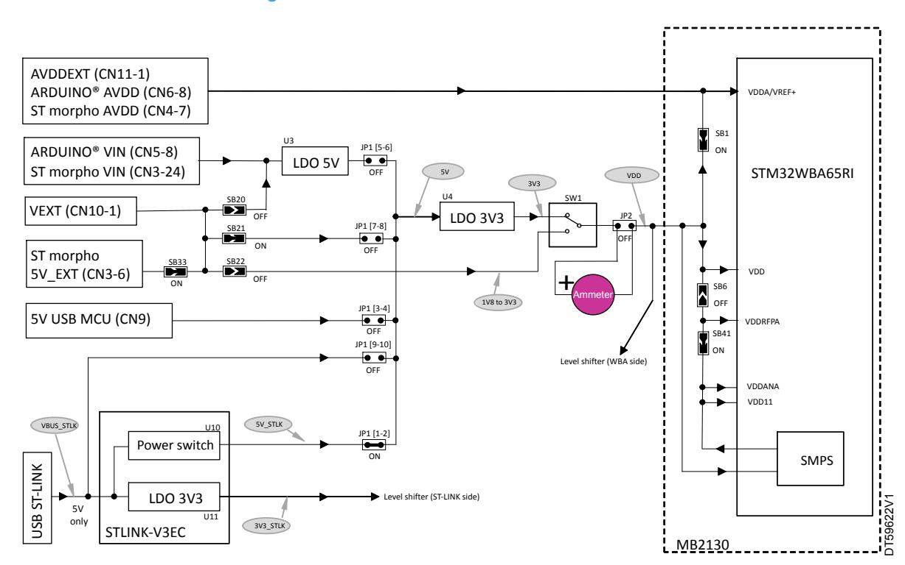

**2.** Use an external power supply with current measurement capability. In this case, the jumper (JP2) must be removed and the supply connected to pin 2 of JP2 (refer to Figure 9). The supply voltage must be between 1V8 and 3V3. AVDD input must not be used and SB1 must be ON during this measurement. You can select any source on JP1 but STM recommends the [1-2] position as there is a power switch protection.

**Figure 9. Current measurement with an external power supply**

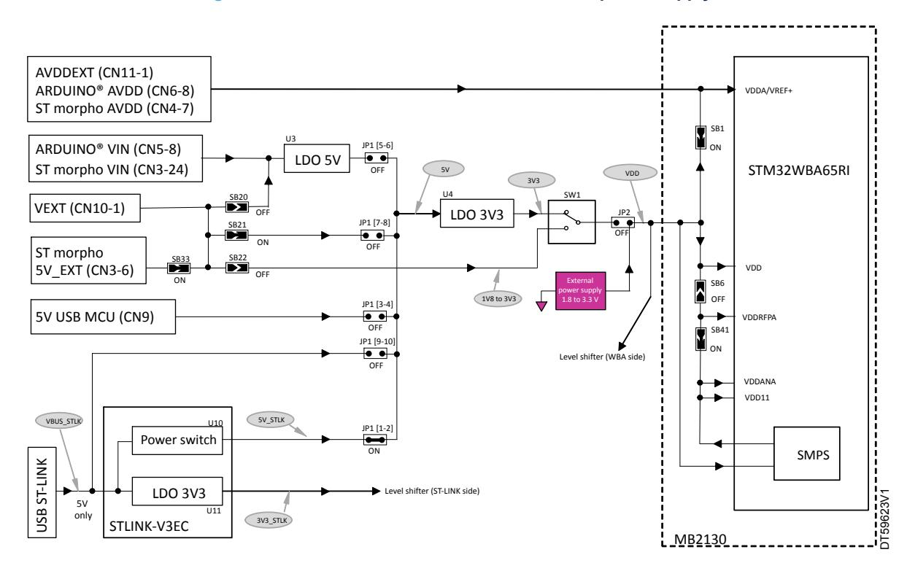

**Caution:** *As explained above, the supply voltage VDD must be between 1.8 and 3.3 V. The limit of 3.3 V is due to level shifters (when STM32WBA65RI can support 3.6 V).*

**3.** If it is necessary to do power consumption measurement during debugging, STMicroelectronics has an interesting solution. It is possible to use STLINK-V3PWR. This product allows two sources of supply: a first for the current measurement on the STM32WBA65RI, and a second for the rest of the board, such as LEDs. Like in the previous case, the jumper (JP2) must be removed, and the main supply for the current measurement is connected to pin 2 of JP2 (refer to Figure 10). For the second source (+5V), remove the jumper on JP1 and connect this source to the top side (pin 1, 3, 5, 7, or 9 of JP1).

The supply voltage must be between 1.8 and 3.3 V. AVDD input must not be used, and SB1 must be ON during this measurement.

**Figure 10. Current measurement with STLINK-V3PWR**

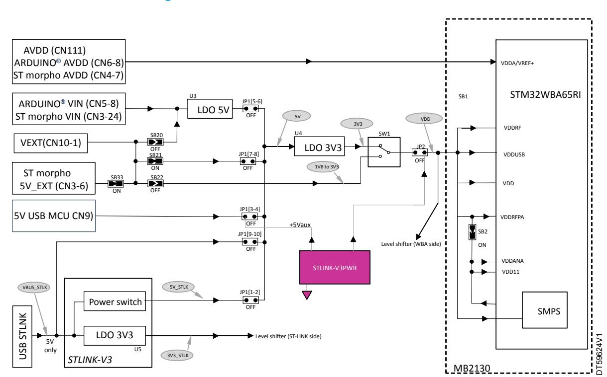

The details above concern the supply of the board by STLINK-V3PWR. Now, the debug feature of these tools also needs some modification.

By default, MB2130 is delivered without the possibility of debugging by an external tool. Nevertheless, it is possible to solder an ETM 20 connector on the CN4 footprint.

For more details, refer to [Section 7.13: ETM 20 interface and pinout](#page-33-0)

**Caution:** *By default, this 20*‑*pin ETM connector (CN4) is not assembled because it prohibits the use of an ARDUINO® shield. The height of the connector is not compatible with the plug of the ARDUINO® shield. Moreover, it is always possible to plug an ST morpho shield on the bottom side of MB1801.*

**Figure 11. Configuration for current measurement with STLINK-V3PWR**

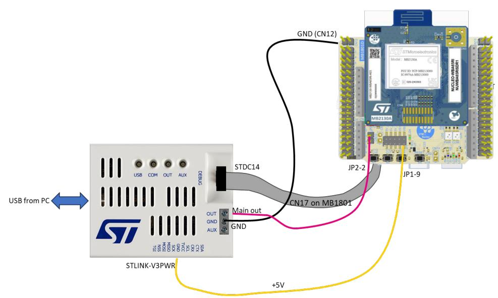

**Caution:** *No VCP is available on the MIPI10 connector (CN17). If you need VCP1, replace connector CN17 with a 14*‑*pin STDC14 connector.*

> After connection, download STM32CubeMonitor-Power ([STM32CubeMonPwr](https://www.st.com/en/product/stm32cubemonpwr?ecmp=tt9470_gl_link_feb2019&rt=um&id=UM3448)) from the *[www.st.com](https://www.st.com)* website and install it. This software allows the user to carry out dynamic current measurements with ease. Figure 12 shows an example of a current measurement (firmware: *Heart Rate* from the STM32CubeWBA firmware package).

**Figure 12. Example of current measurement with an external STLINK-V3PWR**

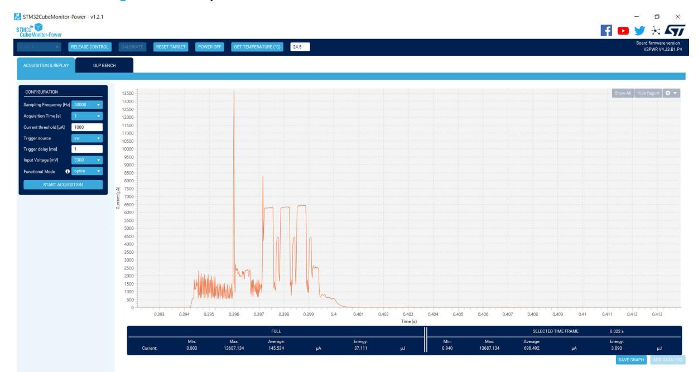

For more details on using STLINK-V3PWR, a dedicated page is available on the *[www.st.com](https://www.st.com)* website.

## **7.2 Radio output configuration**

- By default, the board is configured with R2 ON and R3 OFF to use the PCB antenna.
- The configuration to use the SMA antenna is R2 OFF and R3 ON. The user must assemble the SMA connector not present by default.

**Figure 13. Antenna elements on MCU RF board**

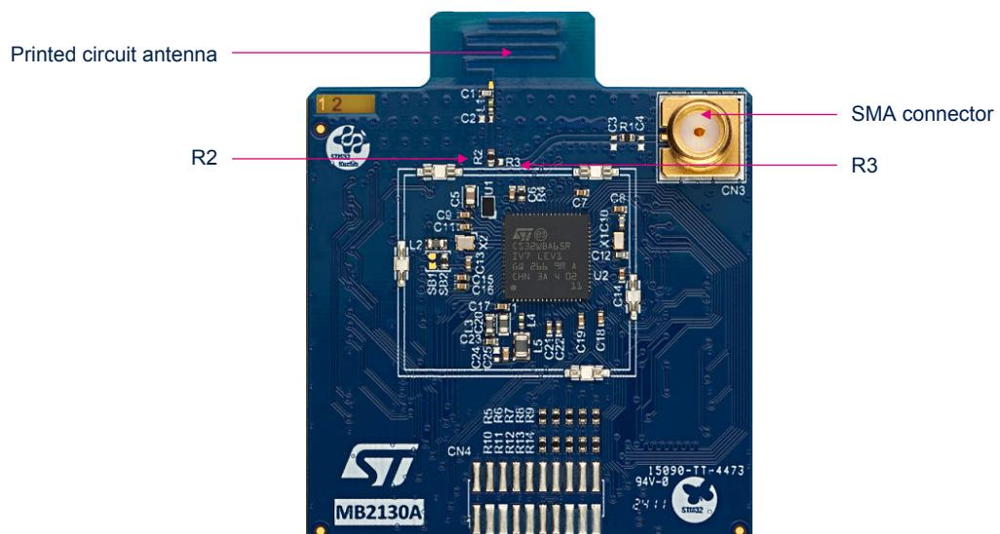

## **7.3 Clock sources**

#### **7.3.1 HSE clock references**

The accuracy of the high‑speed clock (HSE) of the MCU RF board is committed to a 32 MHz crystal oscillator. The HSE oscillator is trimmed during board manufacturing.

#### **7.3.2 LSE clock references**

The accuracy of the low‑speed clock (LSE) of the MCU RF board is committed to a 32.768 kHz crystal oscillator.

## **7.4 Reset sources**

The reset signal of NUCLEO-WBA65RI is active LOW. The internal PU forces the RST signal to a high level. The sources of reset are:

- Reset push-button (B4)
- Embedded STLINK-V3EC
- ARDUINO® connector (CN5 pin 3), reset from the ARDUINO® board
- ST morpho connector (CN3 pin 14)

## **7.5 Embedded STLINK-V3EC**

The STLINK-V3EC programming and debugging tool is integrated into NUCLEO-WBA65RI.

Features supported on STLINK-V3EC:

- USB 2.0 high-speed interface
- Probe firmware update through USB
- JTAG communication support up to 21 MHz
- SWD and SWV communication support up to 24 MHz
- 3.0 to 3.6 V application voltage support and 5 V tolerant inputs
- Virtual COM port (VCP) up to 16 Mbps
- Optional drag-and-drop flash memory programming binary files
- Multipath bridge USB to SPI/UART/I 2C/GPIOs
- Status COM LED (LD5) which blinks during communication with the PC (red by default)
- Fault LED (LD6) alerting on USB overcurrent (green, orange, or red)
- USB-C® overvoltage protection (U10) with current limitation

For detailed information about the STLINK-V3EC capabilities such as LED management, drivers, and firmware, refer to the technical note *Overview of ST-LINK derivatives* (TN1235) at *[www.st.com](https://www.st.com)*.

For information about the debugging and programming features of STLINK-V3EC, refer to the user manual *STLINK-V3SET debugger/programmer for STM8 and STM32* (UM2448) at *[www.st.com](https://www.st.com)*.

### **7.5.1 Drivers**

STLINK-V3EC requires a dedicated USB driver, which, for Windows 7® and Windows 8® is available from *[www.st.com](https://www.st.com)*. For Windows 10®, it is not necessary to install the driver. ST-LINK is automatically identified. In case the NUCLEO-WBA65RI board is connected to the PC before the driver is installed, some board interfaces might be declared as *Unknown* in the PC device manager. In this case, the user must install the dedicated driver files and update the driver of the connected device from the device manager, as shown in Figure 14. USB composite device.

*Note: It is preferable to use the USB Composite Device to handle a full recovery.*

**Figure 14. USB composite device**

#### **7.5.2 STLINK-V3EC firmware upgrade**

STLINK-V3EC embeds a firmware mechanism (STSW-LINK007) for the in‑place upgrade through the USB port. The firmware might evolve during the lifetime of the STLINK-V3EC product (for example new functionalities, bug fixes, support for new microcontroller families). Visit the *[www.st.com](https://www.st.com)* website before starting to use the NUCLEO-WBA65RI board, then periodically to stay updated with the latest firmware version.

For detailed information on the ST-LINK USB drivers, refer to the technical note *Overview of ST-LINK derivatives*  (TN1235) at *[www.st.com](https://www.st.com)*.

### **7.5.3 STLINK-V3EC USB connector (CN15)**

The main function of this connector is the access to STLINK-V3EC embedded on the NUCLEO-WBA65RI for the debugging as explained above. It allows supplying the board (refer to [Section 7.1: Power supply](#page-12-0)). The connector is a standard USB Type-C® connector.

### **Table 5. STLINK-V3EC USB Type-C® connector (CN15)**

| Pin              | Pin name | Signal name | Function               |
|------------------|----------|-------------|------------------------|
| A4, A9, B4, B9   | VBUS     | VBUS_STLK   | VBUS power             |
| A7, B7           | DM       | STLK_USB_N  | DM                     |
| A6, B6           | DP       | STLK_USB_P  | DP                     |
| A5               | CC1      |             | Configuration Channel |
| B5               | CC2      |             | Configuration Channel |
| A1, A12, B1, B12 | GND      | GND         | GND                    |

#### **7.5.4 Virtual COM port USART1 (VCP1)**

STLINK-V3EC offers a USB Virtual COM port bridge. This feature allows access to the USART1 of NUCLEO-WBA65RI by the USB ST-LINK connector. By default, this USART1 interface of NUCLEO-WBA65RI is connected to the VCP1 of the STLINK-V3EC MCU (STM32F723IE).

Access is possible on the CN3 connector of the mezzanine board (MB1801). Both signals Tx and Rx are available, and two solder bridges allow disconnecting them of the UART coming from the SoC. By default, VCP1 is connected to the USART1 of STM32WBA65RI.

**Table 6. VCP1 interface pinout description**

| STM32WBA65RI           | CN3                      | STM32F723IE            |
|------------------------|--------------------------|------------------------|
| USART1 Rx (PA8/pin 5)  | Pin 35 (GPIO23) (SB5 ON) | STLINK_TX: PG14/pin A7 |
| USART1 Tx (PB12/pin 4) | Pin 37 (GPIO24) (SB3 ON) | STLINK_RX: PG9/pin C10 |

## **7.5.5 Virtual COM port USART2 (VCP2)**

It is possible to replace the mass storage interface with a second Virtual COM port. It is also necessary to do a firmware upgrade through STM32CubeProgrammer (refer to the technical note *Overview of ST-LINK derivatives*  (TN1235) at *[www.st.com](https://www.st.com)*.

The access is possible on the CN3 and CN4 connectors of the mezzanine board (MB1801). All signals (Tx, Rx, RTS, and CTS) are available. SB4 needs to be connected to use PA15 as RTS.

**Table 7. VCP2 interface pinout description**

| STM32WBA65RI     | CN3 and CN4         | STM32F723IE              |
|------------------|---------------------|--------------------------|
| USART2_RX (PA11) | CN4/pin 37 (GPIO55) | STLINK_TX: PC10/pin B14  |
|                  | CN4/pin 35 (GPIO54) | STLINK_RX: PB11/pin R13  |
| USART2_CTS(PB15) | CN4/pin26 (GPIO46)  | STLINK_RTS: PD12/pin N13 |
|                  | CN3/pin2 (GPIO2)    | STLINK_CTS: PD11/pin N14 |

### **7.5.6 Level shifter**

NUCLEO-WBA65RI features a system to supply STM32WBA65RI with a voltage different from the ST-LINK one. 3V3 sources always supply ST-LINK. By default, the same voltage value supplies STM32WBA65RI and ST-LINK, but it is possible to supply the SoC with another value. It accepts voltage between 1.8 and 3.3 V trust to a specific component (level shifter). This level shifter ensures the voltage conversion between ST-LINK and the SoC. It drives SWD and UART signals connected to the VCP1 or VCP2 on the ST-LINK.

## **7.6 LEDs**

Four LEDs on the top side of the Nucleo board help the user during the application development.

**Figure 15. LEDs location**

DT59626V1

User LED (LD1)

ST-LINK status LED (LD4)

User LED (LD2) User LED (LD3)

ST-LINK power LED (LD5) ST-LINK COM LED (LD6)

- LD1: This blue LED is available for user application.
- LD2: This green LED is available for user application.
- LD3: This red LED is available for user application.
- LD4: This LED turns green when a 5V source is available (to select the 5V source, refer to [Section 7.1.3: 5 V power supply](#page-13-0)).
- LD5: This LED gives information about the STLINK-V3EC target power.
- LD6: This LED blinks during communication with the PC.

For detailed information about the STLINK-V3EC LEDs, refer to the technical note *Overview of ST-LINK derivatives* (TN1235) at *[www.st.com](https://www.st.com)*.

**Table 8. I/O configuration for the physical user interface**

| Name           | I/O |
|----------------|-----|
| User LED (LD1) | PD8 |
| User LED (LD2) | PC4 |
| User LED (LD3) | PB8 |

## **7.7 Push-buttons**

#### **7.7.1 Description**

NUCLEO-WBA65RI provides two types of buttons:

- USER1 push-button (B1)
- USER2 push-button (B2)
- USER2 push-button (B3)
- Reset push-button (B4), used to reset the Nucleo board

**Figure 16. Push-button location**

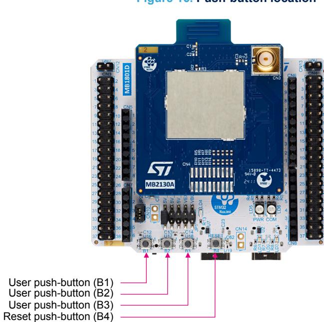

#### **7.7.2 Reset push-button**

B4 is dedicated to the hardware reset of the Nucleo board.

## **7.7.3 User push-buttons**

There are three push buttons available for the user application. They are connected to PC13, PC5, and PB4. It is possible to use with GPIO reading or to wake up the device (only B1).

Note that PC13 is also connected to ARDUINO® and ST morpho connectors as GPIO, depending on the use case that can generate conflict with B1. In this case, it is possible to remove the connection of B1 (SB2 OFF).

**Table 9. I/O configuration for the physical user interface**

| Name                   | I/O  | Wake-Up available |
|------------------------|------|-------------------|
| USER1 push-button (B1) | PC13 | WKUP1             |
| USER2 push-button (B2) | PC5  |                   |
| USER3 push-button (B3) | PB4  |                   |

## **7.8 RF I/O stage**

Due to FCC/ISED constraints, the antenna cannot be removable. So, the board is proposed by default with a PCB antenna. This antenna is described in the application note *Guidelines for meander design using low-cost PCB antennae with 2.4 GHz radio for STM32WB/WB0 MCUs* [\(AN5129\)](https://www.st.com/resource/en/application_note/dm00470410.pdf.pdf) available at *[www.st.com](https://www.st.com)*. Between the STM32WBA65RI and the antenna, there is an integrated passive device (IPD). This IPD considerably reduces harmonics and adapts the output to 50 Ω. This makes it easy to pass certification requirements, such as FCC, ISED, RED, and MIC. At the IPD output, there are two passive components for antenna matching.

The harmonics are drastically reduced with this IPD.

The antenna matching network is built with two components L1 and C1. This guarantees a comfortable margin in all cases. The study considers the drift of the components (accuracy and temperature), the drift due to the PCB, and the variation of STM32WBA65RI. Of course, depending on the component manufacturer and the specification of the PCB, these component values can change after optimization.

**Figure 17. RF I/O stage**

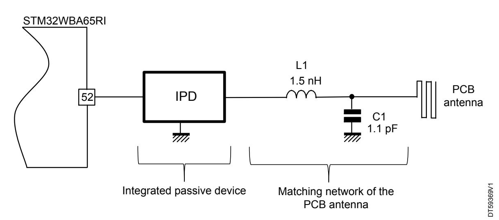

## **7.9 Connector naming**

**Figure 18. Connector locations and namings**

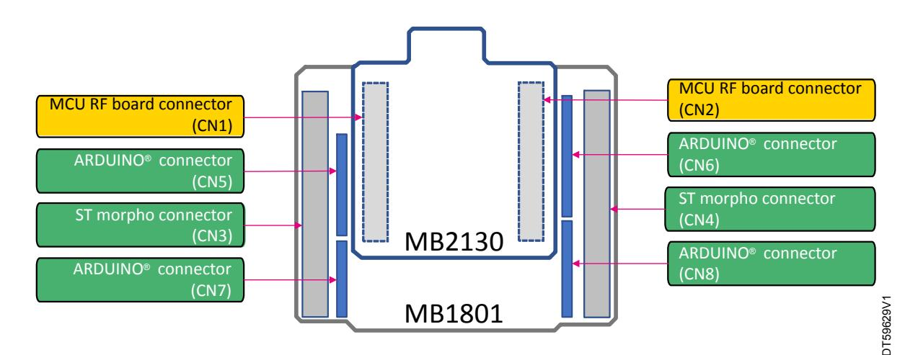

## **7.10 ARDUINO® interface and pinout**

#### **7.10.1 Description**

On the bottom side of the board, there is an ARDUINO® Uno V3 extension socket. It is built around four standard connectors (CN5, CN6, CN7, and CN8). Most shields designed for ARDUINO® can fit with the Discovery kits to offer flexibility in small form factor applications.

**Figure 19. ARDUINO® Uno connectors and ARDUINO® shield location**

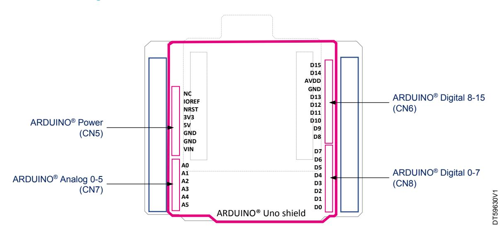

#### **7.10.2 Operating voltage**

The ARDUINO® Uno V3 connectors support 5 V, 3.3 V, and VDD for I/O compatibility.

**Caution:** *Do not supply 3.3 or 5 V from the ARDUINO® shield. Supplying 3.3 or 5 V from the ARDUINO® shield might damage the Nucleo board.*

*The Nucleo board can be supplied by the ARDUINO® connector. A dedicated pin is available. VIN allows supplying the board directly. To use this feature, refer to [Section 7.1.2: 7 to 12 V power supply.](#page-13-0)*

### **7.10.3 ARDUINO® pinout**

[Figure 18](#page-26-0) shows the position of the ARDUINO® shield when plugged into NUCLEO-WBA65RI. The pinout shown in Figure 20 corresponds to standard ARDUINO® naming. To see the correspondence with the STM32, refer to [Table 10](#page-28-0).

**Figure 20. ARDUINO® connector pinout**

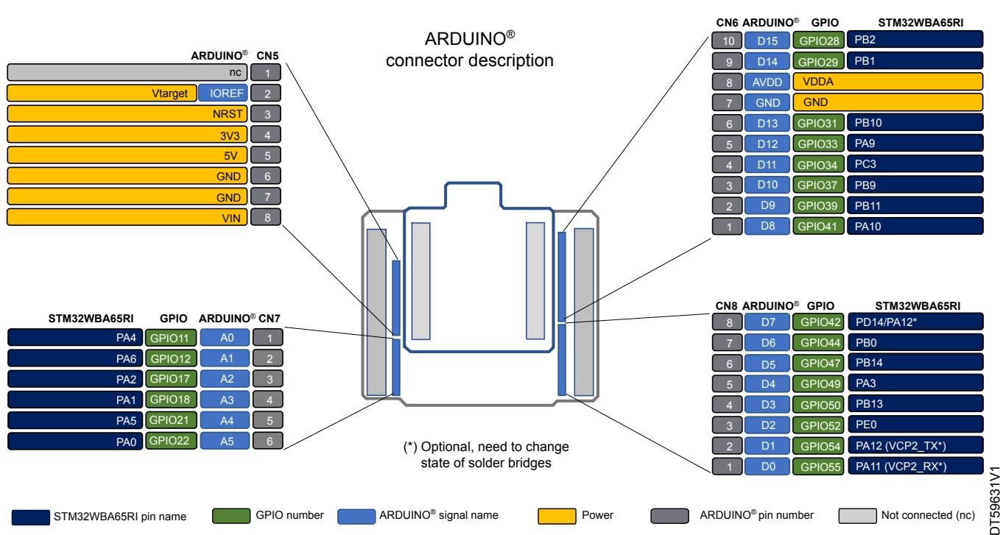

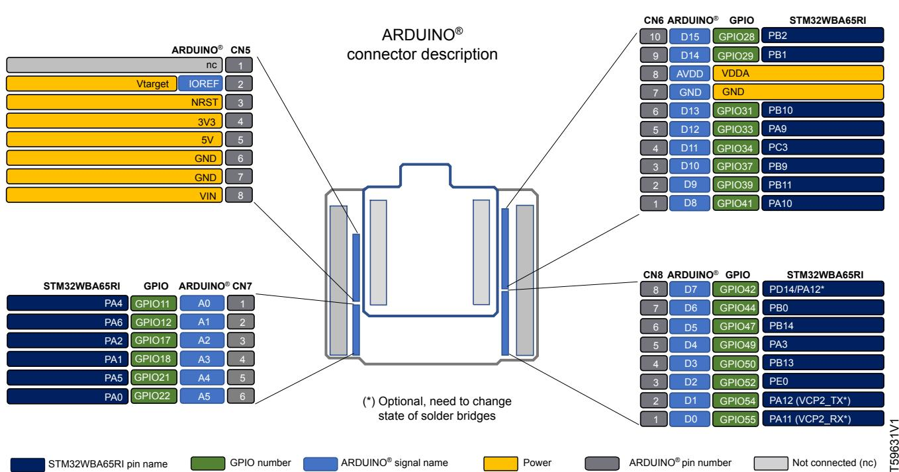

**Table 10. Pinout of the ARDUINO® connectors**

|                      | Left connectors |         |                         |                        | Right connectors |          |                      |
|----------------------|-----------------|---------|-------------------------|------------------------|------------------|----------|----------------------|
| Connector Pin number | Pin name        | MCU pin | Function                | Function               | MCU pin          | Pin name | Pin number Connector |
|                      |                 |         |                         | I2C1_SCL/I2C3_SCL      | PB2              | D15      | 10                   |
|                      |                 |         |                         | I2C1_SDA/I2C3_SDA      | PB1              | D14      | 9                    |
|                      |                 |         |                         | VDDA                   |                  | AVDD     | 8                    |
|                      |                 |         |                         | GND                    |                  | GND      | 7                    |
| 1                    | NC              |         | NC (reserved for tests) | SPI2_SCK/16_BKIN       | PB10             | D13      | 6                    |
| 2                    | 3V3             |         |                         |                        |                  |          |                      |
|                      |                 |         | IOREF                   | SPI2_MISO              | PA9              | D12      | 5                    |
| 3                    | NRST            | NRST    | NRST                    | SPI2_MOSI              | PC3              | D11      | 4                    |
| 4                    | 3V3             |         | 3V3                     | SPI2_NSS               | PB9              | D10      | 3                    |
| 5                    | 5V              |         | 5V                      | GPIO/TIM1_CH1          | PB11             | D9       | 2                    |
| 6                    | GND             |         | GND                     | GPIO/TIM3_CH1          | (1) PA10         | D8       | 1                    |
| 7                    | GND             |         | GND                     |                        |                  |          |                      |
| 8                    | VIN             |         | External supply input   |                        |                  |          |                      |
|                      |                 |         | (+12Vmax)               | GPIO/TIM4_CH3/TIM1_CH2 | PD14/            |          |                      |
|                      |                 |         |                         |                        | PA12 (1)         |          |                      |
|                      |                 |         |                         |                        |                  | D7       | 8                    |
|                      |                 |         |                         | GPIO/TIM1_CH3N         | PB0              | D6       | 7                    |
| 1                    | A0              | PA4     | ADC4_IN5                | GPIO/TIM3_CH3          | PB14             | D5       | 6                    |
| 2                    | A1              | PA6     | ADC4_IN3                | GPIO/TIM16_CH1N        | PA3              | D4       | 5                    |
| 3                    | A2              | PA2     | ADC4_IN7                | GPIO/TIM3_CH4          | PB13             | D3       | 4                    |
| 4                    | A3              | PA1     | ADC4_IN8                | GPIO/TIM16_CH1         | PE0              | D2       | 3                    |
| 5                    | A4              | PA5     | ADC4_IN4                | USART2_TX (1)          | PA12             | D1       | 2                    |
| 6                    | A5              | PA0     | ADC4_IN9                | USART2_RX (1)          | PA11             | D0       | 1                    |

*1. Optional, need to change the state of solder bridges.*

## **7.11 ST morpho interface and pinout**

### **7.11.1 Description**

The ST morpho connectors (CN3 and CN4) are male pin headers accessible on both sides of the board. All signals and power pins of the MCU are available on the ST morpho connectors. An oscilloscope, logical analyzer, or voltmeter can also probe these connectors.

#### **7.11.2 ST morpho pinout**

**Figure 21. ST morpho pinout**

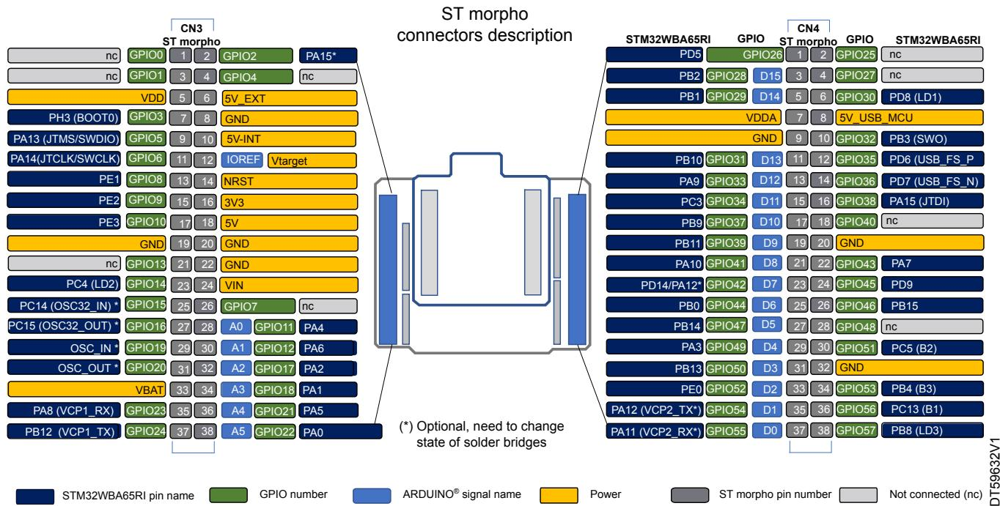

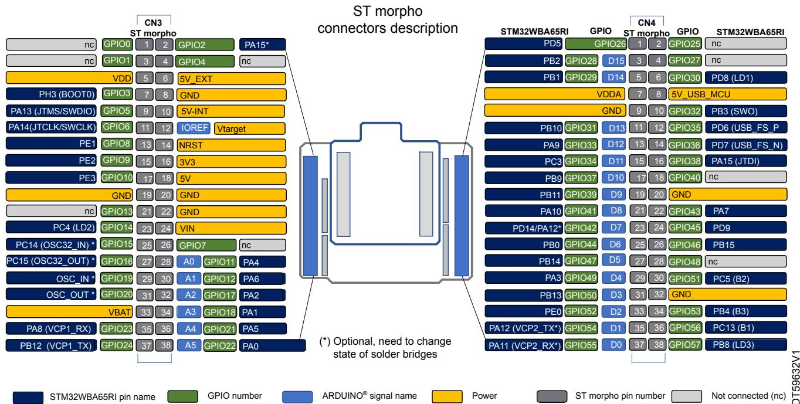

**Table 11. ST morpho pinout**

|    |             | CN3 |          |    |               | CN4    |               |
|----|-------------|-----|----------|----|---------------|--------|---------------|
| 1  | NC          | 2   | PA15 (1) | 1  | PD5           | 2      | NC            |
| 3  | NC          | 4   | NC       | 3  | PB2           | 4      | NC            |
| 5  | VDD         | 6   | 5V_EXT   | 5  | PB1           | 6      | PD8           |
| 7  | BOOT0       | 8   | GND      | 7  | VDDA          | 8      | 5V_USB_MCU    |
| 9  | PA13        | 10  | NC       | 9  | GND           | 10     | PB3/SWO       |
| 11 | PA14        | 12  | IOREF    | 11 | PB10          | 12     | PD6(USB_FS_P) |
| 13 | NC          | 14  | NRST     | 13 | PA9           | 14     | PD7(USB_FS_N) |
| 15 | NC          | 16  | 3V3      | 15 | PC3           | 16     | PA15 (JTDI)   |
| 17 | NC          | 18  | 5V       | 17 | PB9           | 18     | NC            |
| 19 | GND         | 20  | GND      | 19 | PB11          | 20     | GND           |
| 21 | NC          | 22  | GND      | 21 | PA10          | 22     | PA7           |
| 23 | PC4         | 24  | VIN      | 23 | PD14/PA12 (1) | 24     | PD9           |
| 25 | PC14        | 26  | NC       | 25 | PB0           | 26     | PB15          |
| 27 | PC15        | 28  | PA4      | 27 | PB14          | 28     | NC            |
| 29 | OSC_IN (1)  | 30  | PA6      | 29 | PA3           | 30     | PC5           |
| 31 | OSC_OUT (1) | 32  | PA2      | 31 | PB13          | 32     | GND           |
| 33 | VBAT        | 34  | PA1      | 33 | PE0           | 34     | PB4           |
| 35 | PA8         | 36  | PA5      | 35 | PA12(VCP2_TX) | (1) 36 | PC13          |
| 37 | PB12        | 38  | PA0      | 37 | PA11(VCP2_RX) | (1) 38 | PB8           |

*1. Optional, need to change the state of solder bridges.*

## **7.12 MCU RF board interface and pinout**

#### **7.12.1 Description**

The MCU RF board connectors (CN1 and CN2) are accessible on the top side of the board. They are used to plug the MCU RF board into the mezzanine board.

### **7.12.2 MCU RF board pinout**

**Figure 22. MCU RF board connector pinout**

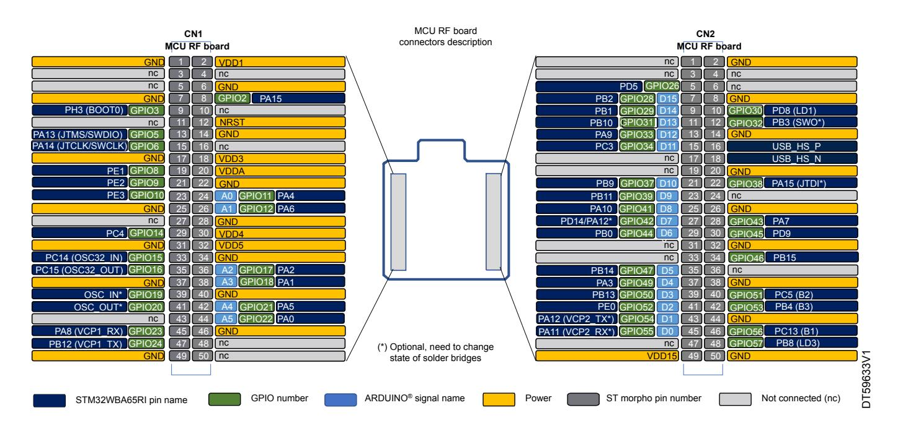

**Table 12. MCU RF board connector pinout**

|    |             | CN1 |      |    |               | CN2 |                    |
|----|-------------|-----|------|----|---------------|-----|--------------------|
| 1  | GND         | 2   | VDD1 | 1  | NC            | 2   | GND                |
| 3  | NC          | 4   | NC   | 3  | NC            | 4   | NC                 |
| 5  | NC          | 6   | GND  | 5  | PD5           | 6   | NC                 |
| 7  | GND         | 8   | PA15 | 7  | PB2           | 8   | GND                |
| 9  | BOOT0       | 10  | NC   | 9  | PB1           | 10  | PD8                |
| 11 | NC          | 12  | NRST | 11 | PB10          | 12  | PB3/SWO (1)        |
| 13 | PA13        | 14  | GND  | 13 | PA9           | 14  | GND                |
| 15 | PA14        | 16  | NC   | 15 | PC3           | 16  | NC                 |
| 17 | GND         | 18  | VDD3 | 17 | NC            | 18  | NC                 |
| 19 | PE1         | 20  | VDDA | 19 | NC            | 20  | GND                |
| 21 | PE2         | 22  | GND  | 21 | PB9           | 22  | PA15 (1) /JTDI (1) |
| 23 | PE3         | 24  | PA4  | 23 | PB11          | 24  | NC                 |
| 25 | GND         | 26  | PA6  | 25 | PA10          | 26  | GND                |
| 27 | NC          | 28  | GND  | 27 | PD14/PA12 (1) | 28  | PA7                |
| 29 | PC4         | 30  | VDD4 | 29 | PB0           | 30  | PD9                |
| 31 | GND         | 32  | VDD5 | 31 | NC            | 32  | GND                |
| 33 | PC14        | 34  | GND  | 33 | NC            | 34  | PB15 (1)           |
| 35 | PC15        | 36  | PA2  | 35 | PB14          | 36  | NC                 |
| 37 | GND         | 38  | PA1  | 37 | PA3           | 38  | GND                |
| 39 | OSC_IN (1)  | 40  | GND  | 39 | PB13          | 40  | PC5                |
| 41 | OSC_OUT (1) | 42  | PA5  | 41 | PE0           | 42  | PB4                |
| 43 | NC          | 44  | PA0  | 43 | PA12          | 44  | GND                |
| 45 | PA8         | 46  | GND  | 45 | PA11          | 46  | PC13               |
| 47 | PB12        | 48  | NC   | 47 | NC            | 48  | PB8                |
| 49 | GND         | 50  | NC   | 49 | VDD15         | 50  | GND                |

*1. Optional, need to change the state of solder bridges.*

## **7.13 ETM 20 interface and pinout**

#### **7.13.1 Description**

On the MCU RF board, there is a footprint for direct debugging. This is an ETM 20 connector. By default, the ETM connector (CN4) is not assembled. On MB2130, ETM trace is available. To perform an ETM trace, it is necessary to solder the CN4 connector.

For high-speed trace, the resistors R5, R6, R7, R8, and R9 must be removed.

#### **7.13.2 ETM 20 pinout**

#### **Figure 23. ETM 20 footprint**

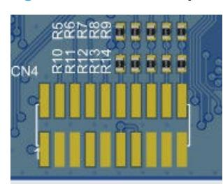

#### **Table 13. ETM 20 pinout**

| ETM pin number | Pin description | Type                    |
|----------------|-----------------|-------------------------|
| 1              | VDD             | Power supply            |
| 2              | ETM.SWDIO       | SWD data                |
| 3              | GND             | Ground                  |
| 4              | ETM.SWCLK       | SWD clock               |
| 5              | GND             | Ground                  |
| 6              | ETM.SWO         | SWO                     |
| 7              | NC              | Not connected           |
| 8              | ETM.JTDI        | JTDI                    |
| 9              | GND             | Ground                  |
| 10             | NRST            | RESET signal active low |
| 11             | NC              | Not connected           |
| 12             | ETM.CLK         | ETM clock               |
| 13             | NC              | Not connected           |
| 14             | ETM.D0          | ETM Data0               |
| 15             | GND             | Ground                  |
| 16             | ETM.D1          | ETM Data1               |
| 17             | GND             | Ground                  |
| 18             | ETM.D2          | ETM Data3               |
| 19             | GND             | Ground                  |
| 20             | ETM.D3          | ETM Data3               |

## **7.14 MIPI10 connector**

On the mezzanine board, there is a connector (CN17) for direct debugging. This connector is compatible with MIPI10 and it is possible to change the connector or connect the missing signals to have STDC14 full signals. Nevertheless, it is necessary to put the onboard ST-LINK in reset mode by mounting JP3.

**Table 14. Pinout of the MIPI10/STDC14 connector (CN3 of the MCU RF board)**

| STDC14 pin # | MIPI10 pin # | Pin description  | Type |
|--------------|--------------|------------------|------|
| 1            |              | Reserved (1)     |      |
| 2            |              | Reserved (1)     |      |
| 3            | 1            | T_VCC (2)        | I    |
| 4            | 2            | T_JTMS/T_SWDIO   | I/O  |
| 5            | 3            | GND              | S    |
| 6            | 4            | T_JCLK/T_SWCLK   | O    |
| 7            | 5            | GND              | S    |
| 8            | 6            | T_JTDO/T_SWO (3) | I    |
| 9            | 7            | T_JCLK           | O    |
| 10           | 8            | T_JTDI/NC (4)    | O    |
| 11           | 9            | GNDDetect        | O    |
| 12           | 10           | T_NRST           | O    |
| 13           |              | T_VCP_RX         | O    |
| 14           |              | T_VCP_TX         | I    |

- *1. Do not connect to the target.*
- *2. Input for STLINK-V3EC*
- *3. SWO is optional, required only for Serial Wire Viewer (SWV)*
- *4. NC means it is not required for the SWD connection.*

## **8 NUCLEO-WBA65RI product information**

## **8.1 Product marking**

The product and each board composing the product are identified with one or several stickers. The stickers, located on the top or bottom side of each PCB, provide product information:

- Main board featuring the target device: product order code, product identification, serial number, and board reference with revision.

Single-sticker example:

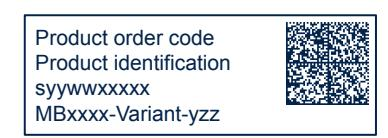

#### Dual-sticker example:

Product order code

Product identification and MBxxxx-Variant-yzz

syywwxxxxx

- Other boards if any: board reference with revision and serial number.

Examples:

DT76507V1

syywwxxxxx MBxxxx-Variant-yzz

or

MBxxxx-Variant-yzz syywwxxxxx

or

DT76508V1

or

On the main board sticker, the first line provides the product order code, and the second line the product identification.

On all board stickers, the line formatted as *"MBxxxx-Variant-yzz"* shows the board reference *"MBxxxx"*, the mounting variant *"Variant"* when several exist (optional), the PCB revision *"y"*, and the assembly revision *"zz"*, for example B01. The other line shows the board serial number used for traceability.

Products and parts labeled as *"ES"* or *"E"* are not yet qualified or feature devices that are not yet qualified. STMicroelectronics disclaims any responsibility for consequences arising from their use. Under no circumstances will STMicroelectronics be liable for the customer's use of these engineering samples. Before deciding to use these engineering samples for qualification activities, contact STMicroelectronics' quality department.

*"ES"* or *"E"* marking examples of location:

- On the targeted STM32 that is soldered on the board (for an illustration of STM32 marking, refer to the STM32 datasheet *Package information* paragraph at the *[www.st.com](https://www.st.com)* website).
- Next to the ordering part number of the evaluation tool that is stuck, or silk-screen printed on the board. Some boards feature a specific STM32 device version, which allows the operation of any bundled commercial stack/library available. This STM32 device shows a *"U"* marking option at the end of the standard part number and is not available for sales.

To use the same commercial stack in their applications, the developers might need to purchase a part number specific to this stack/library. The price of those part numbers includes the stack/library royalties.

## **8.2 NUCLEO-WBA65RI product history**

**Table 15. Product history**

| Order Product       |                                                                                       |                            |                     |
|---------------------|---------------------------------------------------------------------------------------|----------------------------|---------------------|
| identification code | Product details                                                                       | Product change description | Product limitations |
| NUCLEO-WBA65RI      | MCU: STM32WBA65RIV7 silicon revision "Z" MCU errata sheet: STM32WBA6xxx device errata |                            |                     |
|                     |                                                                                       | Initial revision           | No limitation       |
| NUWBA65RI\$DR1      | ( ES0644 ) Boards: MB1801-USB-D01 (mezzanine board) MB2130-WBA65RI-A02 (MCU RF board) |                            |                     |

## **8.3 Board revision history**

#### **Table 16. Board revision history**

| Board reference | Board variant and revision | Board change description | Board limitations |
|-----------------|----------------------------|--------------------------|-------------------|
|                 | USB-D01                    | Initial revision         | No limitation     |
|                 | WBA65RI-A02                | Initial revision         | No limitation     |

## **9 Federal Communications Commission (FCC) and ISED Canada Compliance Statements**

## **9.1 FCC Compliance Statement**

Identification of products: NUCLEO-WBA65RI Contains FCC ID: YCP-MB213000

#### **Part 15.19**

This device complies with Part 15 of the FCC Rules. Operation is subject to the following two conditions: (1) this device may not cause harmful interference, and (2) this device must accept any interference received, including interference that may cause undesired operation.

#### **Part 15.21**

Any changes or modifications to this equipment not expressly approved by STMicroelectronics may cause harmful interference and void the user's authority to operate this equipment.

#### **Part 15.105**

This equipment has been tested and found to comply with the limits for a Class B digital device, pursuant to part 15 of the FCC Rules. These limits are designed to provide reasonable protection against harmful interference in a residential installation. This equipment generates uses and can radiate radio frequency energy and, if not installed and used in accordance with the instruction, may cause harmful interference to radio communications. However, there is no guarantee that interference will not occur in a particular installation. If this equipment does cause harmful interference to radio or television reception which can be determined by turning the equipment off and on, the user is encouraged to try to correct interference by one or more of the following measures:

- Reorient or relocate the receiving antenna.
- Increase the separation between the equipment and receiver.
- Connect the equipment into an outlet on a circuit different from that to which the receiver is connected.
- Consult the dealer or an experienced radio/TV technician for help.

#### *Note: Use only shielded cables.*

To satisfy FCC RF exposure requirements, a separation distance of 20 cm or more should be maintained between the antenna of this device and persons during operation. To ensure compliance, operation at a closer distance than this is not recommended. This transmitter must not be collocated or operating in conjunction with any other antenna or transmitter.

#### **Responsible Party – U.S. Contact Information:**

Francesco Doddo STMicroelectronics, Inc. 200 Summit Drive | Suite 405 | Burlington, MA 01803 USA Telephone: +1 781-472-9634

## **9.2 ISED Compliance Statement**

Identification of products: NUCLEO-WBA65RI

Contains IC: 8976A-MB213000

Identification du produit : NUCLEO-WBA65RI

Contient sous-ensemble certifié IC : 8976A-MB213000

#### **Compliance Statement**

Notice: This device complies with ISED Canada licence-exempt RSS standard(s). Operation is subject to the following two conditions: (1) this device may not cause interference, and (2) this device must accept any interference, including interference that may cause undesired operation of the device.

ISED Canada ICES-003 Compliance Label: CAN ICES-3 (B) / NMB-3 (B).

#### **Déclaration de conformité**

Avis: Le présent appareil est conforme aux CNR d'ISDE Canada applicables aux appareils radio exempts de licence. L'exploitation est autorisée aux deux conditions suivantes : (1) l'appareil ne doit pas produire de brouillage, et (2) l'utilisateur de l'appareil doit accepter tout brouillage radioélectrique subi, même si le brouillage est susceptible d'en compromettre le fonctionnement.

Étiquette de conformité à la NMB-003 d'ISDE Canada : CAN ICES-3 (B) / NMB-3 (B).

#### **RF exposure statement**

This device complies with ISED radiation exposure limits set forth for general population. This device must be installed to provide a separation distance of at least 20 cm from all persons and must not be co-located or operating in conjunction with any other antenna or transmitter.

Le présent appareil est conforme aux niveaux limites d'exigences d'exposition RF aux personnes définies par ISDE. L'appareil doit être installé afin d'offrir une distance de séparation d'au moins 20 cm avec les personnes et ne doit pas être installé à proximité ou être utilisé en conjonction avec une autre antenne ou un autre émetteur.

## **10 UKCA Compliance Statement**

#### SIMPLIFIED UK DECLARATION OF CONFORMITY

Hereby, the manufacturer STMicroelectronics, declares that the radio equipment type "NUCLEO-WBA65RI" is in compliance with the UK Radio Equipment Regulations 2017 (UK S.I. 2017 No. 1206). The full text of the UK Declaration of Conformity is available at the following internet address: *[www.st.com](https://www.st.com)*.

## **11 RED Compliance Statement**

#### **Simplified EU declaration of conformity**

Hereby, STMicroelectronics declares that the radio equipment type "NUCLEO-WBA65RI" is in compliance with Directive 2014/53/EU.

The full text of the EU declaration of conformity is available at the following internet address: *[www.st.com](https://www.st.com)*.

#### **Déclaration de conformité UE simplifiée**

STMicroelectronics déclare que l'équipement radioélectrique du type "NUCLEO-WBA65RI" est conforme à la directive 2014/53/UE.

Le texte complet de la déclaration de conformité UE est disponible à l'adresse internet suivante: *[www.st.com](https://www.st.com)*.

# **12 Product disposal**

#### **Disposal of this product: WEEE (Waste Electrical and Electronic Equipment)** (Applicable in Europe)

This symbol on the product, accessories, or accompanying documents indicates that the product and its electronic accessories should not be disposed of with household waste at the end of their working life.

To prevent possible harm to the environment and human health from uncontrolled waste disposal, please separate these items from other type of waste and recycle them responsibly to the designated collection point to promote the sustainable reuse of material resources.

#### Household users:

You should contact either the retailer where you buy the product or your local authority for further details of your nearest designated collection point.

#### Business users:

You should contact your dealer or supplier for further information.

## **Revision history**

### **Table 17. Document revision history**

| Date        | Revision | Changes          |
|-------------|----------|------------------|
| 28-Feb-2025 | 1        | Initial release. |

# **Contents**

| 1   | Features                               | 2  |
|-----|----------------------------------------|----|
| 2   | Ordering information                   | 3  |
| 2.1 | Codification                           | 3  |
| 3   | Development environment                | 4  |
| 3.1 | System requirements                    | 4  |
| 3.2 | Development toolchains                 | 4  |
| 3.3 | Demonstration software                 | 4  |
| 3.4 | CAD resources                          | 4  |
| 4   | Conventions                            | 5  |
| 5   | Safety recommendations                 | 6  |
| 5.1 | Targeted audience                      | 6  |
| 5.2 | Handling the board                     | 6  |
| 6   | Quick start                            | 7  |
| 6.1 | Getting started                        | 7  |
| 7   | Hardware layout and configuration      | 8  |
| 7.1 | Power supply                           | 13 |
|     | 7.1.1 General description              | 13 |
|     | 7.1.2 7 to 12 V power supply           | 14 |
|     | 7.1.3 5 V power supply                 | 14 |
|     | 7.1.4 Current measurement              | 16 |
| 7.2 | Radio output configuration             | 20 |
| 7.3 | Clock sources                          | 20 |
|     | 7.3.1 HSE clock references             | 20 |
|     | 7.3.2 LSE clock references             | 20 |
| 7.4 | Reset sources                          | 21 |
| 7.5 | Embedded STLINK-V3EC                   | 21 |
|     | 7.5.1 Drivers                          | 21 |
|     | 7.5.2 STLINK-V3EC firmware upgrade     | 22 |
|     | 7.5.3 STLINK-V3EC USB connector (CN15) | 22 |
|     | 7.5.4 Virtual COM port USART1 (VCP1)   | 23 |
|     | 7.5.5 Virtual COM port USART2 (VCP2)   | 23 |
|     | 7.5.6 Level shifter                    | 23 |
| 7.6 | LEDs                                   | 24 |
| 7.7 | Push-buttons                           | 25 |
|     | 7.7.1 Description                      | 25 |

|                  | 7.7.2 Reset push-button                                            | 25                                                               |
|------------------|--------------------------------------------------------------------|------------------------------------------------------------------|
|                  | 7.7.3 User push-buttons                                            | 25                                                               |
| 7.8              | RF I/O stage                                                       | 26                                                               |
| 7.9              | Connector naming                                                   | 27                                                               |
| 7.10             | ARDUINO ® interface and pinout                                     | 27                                                               |
|                  | 7.10.1 Description                                                 | 27                                                               |
|                  | 7.10.2 Operating voltage                                           | 28                                                               |
|                  | 7.10.3 ARDUINO ®                                                   | pinout....................................................... 28 |
| 7.11             | ST morpho interface and pinout                                     | 30                                                               |
|                  | 7.11.1 Description                                                 | 30                                                               |
|                  | 7.11.2 ST morpho pinout                                            | 30                                                               |
| 7.12             | MCU RF board interface and pinout                                  | 32                                                               |
|                  | 7.12.1 Description                                                 | 32                                                               |
|                  | 7.12.2 MCU RF board pinout                                         | 32                                                               |
| 7.13             | ETM 20 interface and pinout                                        | 34                                                               |
|                  | 7.13.1 Description                                                 | 34                                                               |
|                  | 7.13.2 ETM 20 pinout                                               | 34                                                               |
| 7.14             | MIPI10 connector                                                   | 35                                                               |
| 8                | NUCLEO-WBA65RI product information                                 | .36                                                              |
| 8.1              | Product marking                                                    | 36                                                               |
| 8.2              | NUCLEO-WBA65RI product history                                     | 37                                                               |
| 8.3              | Board revision history                                             | 37                                                               |
| 9                | Federal Communications Commission (FCC) and ISED Canada Compliance |                                                                  |
|                  | Statements                                                         | .38                                                              |
| 9.1              | FCC Compliance Statement                                           | 38                                                               |
| 9.2              | ISED Compliance Statement                                          | 39                                                               |
| 10               | UKCA Compliance Statement                                          | .40                                                              |
| 11               | RED Compliance Statement                                           | .41                                                              |
| 12               | Product disposal                                                   | .42                                                              |
|                  | Revision history                                                   | .43                                                              |
| List of tables   |                                                                    | .46                                                              |
| List of figures. |                                                                    | .47                                                              |

## **List of tables**

| Table 1.  | List of available products.                                     | 3  |
|-----------|-----------------------------------------------------------------|----|
| Table 2.  | Codification explanation                                        | 3  |
| Table 3.  | ON/OFF convention                                               | 5  |
| Table 4.  | Power supply selector (JP1) description                         | 15 |
| Table 5.  | STLINK-V3EC USB Type-C ® connector (CN15)                       | 22 |
| Table 6.  | VCP1 interface pinout description                               | 23 |
| Table 7.  | VCP2 interface pinout description                               | 23 |
| Table 8.  | I/O configuration for the physical user interface               | 24 |
| Table 9.  | I/O configuration for the physical user interface               | 25 |
| Table 10. | Pinout of the ARDUINO ® connectors                              | 29 |
| Table 11. | ST morpho pinout                                                | 31 |
| Table 12. | MCU RF board connector pinout                                   | 33 |
| Table 13. | ETM 20 pinout                                                   | 34 |
| Table 14. | Pinout of the MIPI10/STDC14 connector (CN3 of the MCU RF board) | 35 |
| Table 15. | Product history                                                 | 37 |
| Table 16. | Board revision history                                          | 37 |
| Table 17. | Document revision history                                       | 43 |

# **List of figures**

| Figure 1.  | NUCLEO-WBA65RI global view                                     | 1  |
|------------|----------------------------------------------------------------|----|
| Figure 2.  | Hardware block diagram                                         | 8  |
| Figure 3.  | NUCLEO-WBA65RI PCB top view                                    | 9  |
| Figure 4.  | NUCLEO-WBA65RI PCB bottom view of mezzanine board (MB1801)     | 10 |
| Figure 5.  | NUCLEO-WBA65RI (MB1801) mechanical dimensions (in millimeters) | 11 |
| Figure 6.  | NUCLEO-WBA65RI (MB2130) mechanical dimensions (in millimeters) | 12 |
| Figure 7.  | STM32WBA65RI power tree                                        | 13 |
| Figure 8.  | Current measurement with an ammeter                            | 16 |
| Figure 9.  | Current measurement with an external power supply              | 17 |
| Figure 10. | Current measurement with STLINK-V3PWR                          | 18 |
| Figure 11. | Configuration for current measurement with STLINK-V3PWR        | 19 |
| Figure 12. | Example of current measurement with an external STLINK-V3PWR   | 19 |
| Figure 13. | Antenna elements on MCU RF board                               | 20 |
| Figure 14. | USB composite device.                                          | 21 |
| Figure 15. | LEDs location                                                  | 24 |
| Figure 16. | Push-button location                                           | 25 |
| Figure 17. | RF I/O stage                                                   | 26 |
| Figure 18. | Connector locations and namings                                | 27 |
| Figure 19. | ARDUINO ® Uno connectors and ARDUINO ® shield location         | 27 |
| Figure 20. | ARDUINO ® connector pinout                                     | 28 |
| Figure 21. | ST morpho pinout                                               | 30 |
| Figure 22. | MCU RF board connector pinout                                  | 32 |
| Figure 23. | ETM 20 footprint                                               | 34 |

#### **IMPORTANT NOTICE – READ CAREFULLY**

STMicroelectronics NV and its subsidiaries ("ST") reserve the right to make changes, corrections, enhancements, modifications, and improvements to ST products and/or to this document at any time without notice. Purchasers should obtain the latest relevant information on ST products before placing orders. ST products are sold pursuant to ST's terms and conditions of sale in place at the time of order acknowledgment.

Purchasers are solely responsible for the choice, selection, and use of ST products and ST assumes no liability for application assistance or the design of purchasers' products.

No license, express or implied, to any intellectual property right is granted by ST herein.

Resale of ST products with provisions different from the information set forth herein shall void any warranty granted by ST for such product.

ST and the ST logo are trademarks of ST. For additional information about ST trademarks, refer to [www.st.com/trademarks.](http://www.st.com/trademarks) All other product or service names are the property of their respective owners.

Information in this document supersedes and replaces information previously supplied in any prior versions of this document.

© 2025 STMicroelectronics – All rights reserved